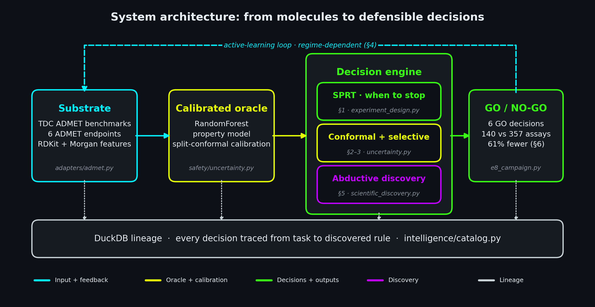
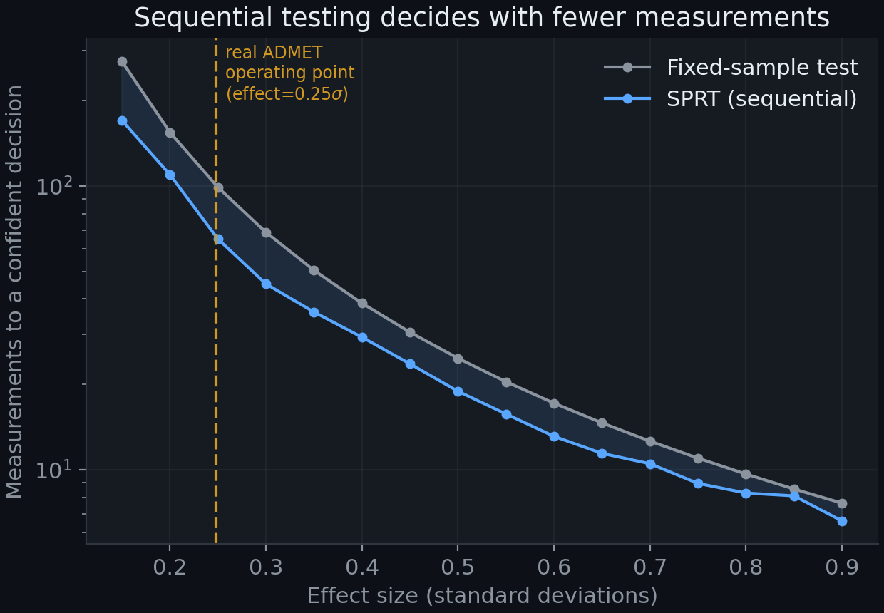
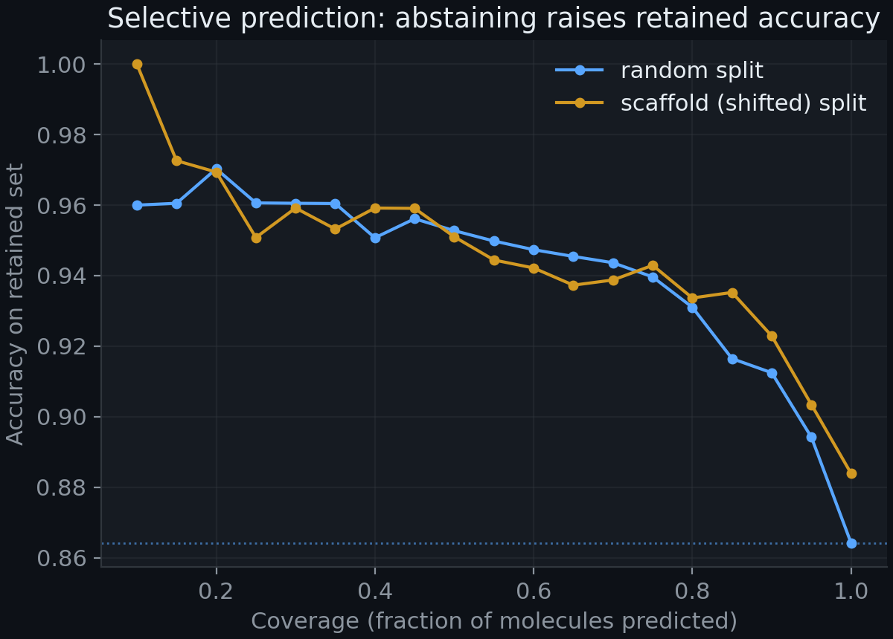
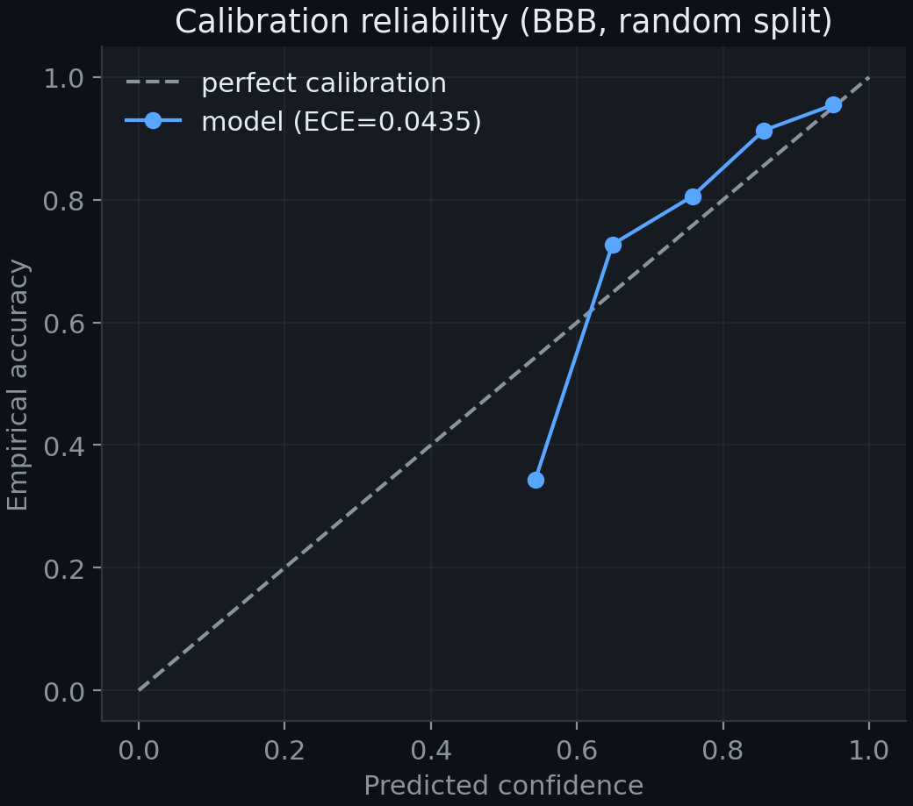
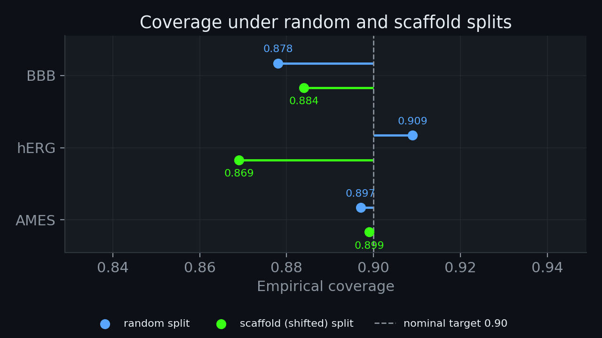
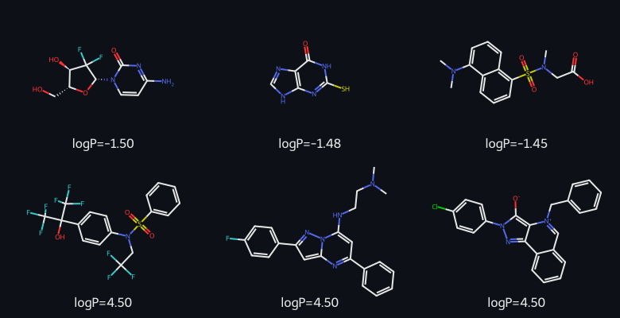
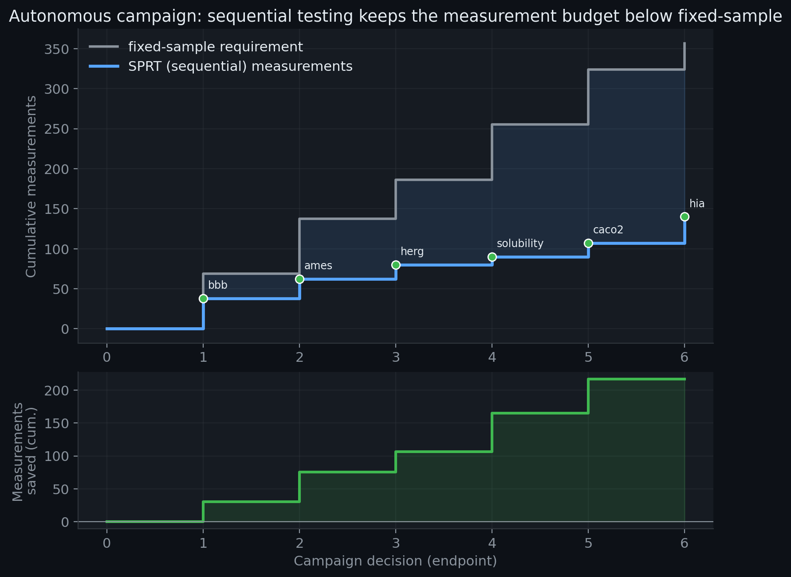
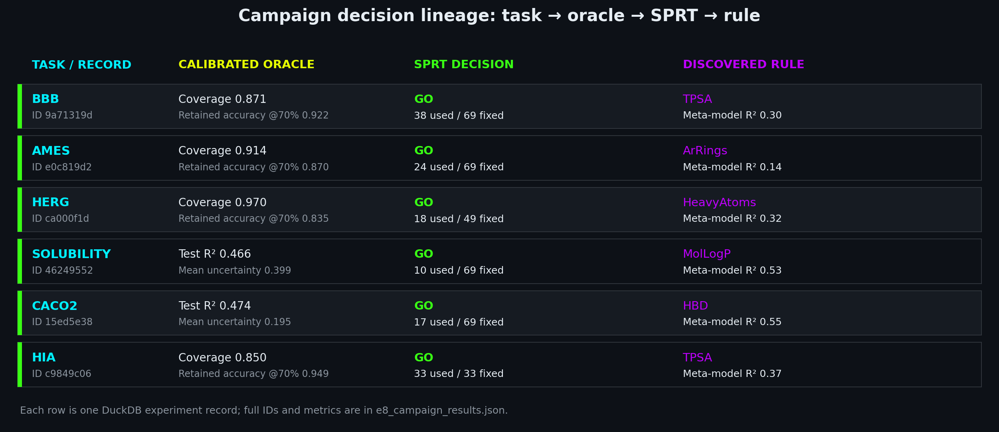

# Knowing what to measure and when to stop: an autonomous decision engine for molecular property discovery

Daniel R. Russell<br>
Autonomous Discovery Systems · Biomedical ML, SNPTX<br>
Correspondence: dan@snptx.ai

## Abstract

Molecular property discovery is bottlenecked by the cost of measurement and by a
trust gap: models rarely say how confident they are, or when enough has been measured
to make a call. We present a calibrated, autonomous, sequential decision engine that
turns ADMET property discovery into three coupled decisions. First, it reaches
confident go/no-go calls with materially fewer measurements using Wald's sequential
probability ratio test (SPRT): at the empirical effect size it needs 65 versus 99
measurements (a 34% saving) and saves 23% on average across effect sizes, at power
0.85 and Type I error 0.043. Second, it quantifies what it does not know with
split-conformal prediction evaluated under leakage-controlled (Murcko scaffold)
shift, with empirical coverage near the nominal 0.90 target (BBB 0.884, hERG
0.869, AMES 0.899; ECE 0.044). Third, it abstains
wisely: selective prediction lifts retained accuracy from 0.864 to 0.94 at 70%
coverage under both random and scaffold splits. Wired into a closed loop with a
pluggable oracle, a novelty archive, an abductive discovery cycle, and DuckDB
provenance, the engine (built on the SNPTX experimentation layer) runs an end-to-end
autonomous campaign that makes traceable decisions, recovers the established
structure-property driver on 5 of 5 ADMET endpoints, and surfaces 1398 interpretable
structure-property cliffs. All results are reproducible from a tagged commit on CPU.

## 1. Introduction

Two costs dominate early molecular discovery. The first is measurement: each assay
consumes material, time, and money, so deciding *how many* molecules to measure before
committing to a go/no-go call is itself a scientific decision. The second is trust: a
point prediction with no calibrated uncertainty cannot be safely acted on, especially
under the distribution shift that is the norm when a program moves into novel chemical
scaffolds. Most ML-for-chemistry work optimizes predictive accuracy on a fixed test
set and stops there, leaving both costs unaddressed.

We take the complementary view that discovery is a *sequential decision problem under
calibrated uncertainty*. Our contribution is an engine that (i) decides when to stop
measuring, (ii) reports guaranteed-coverage uncertainty that holds under scaffold
shift, (iii) abstains on its least-confident cases, and (iv) closes the loop
autonomously while logging a full provenance trail and producing interpretable,
checkable structure-property knowledge. We deliberately do not oversell active
learning: our hardening experiments show its benefit is regime-dependent, and we
report it as a characterized decision rule rather than a headline.

## 2. Related work and positioning

Sequential testing (Wald 1945) and Bayesian experimental design (Chaloner &
Verdinelli 1995; Rainforth et al. 2024) provide the theory for stopping early;
conformal prediction (Vovk et al.; Angelopoulos & Bates 2023) provides
distribution-free coverage; selective prediction (El-Yaniv & Wiener 2010) provides a
principled abstain rule. Our contribution is not a new estimator but a *wiring*: we
compose these primitives around a molecular-graph oracle into an autonomous engine
whose decisions are calibrated, cheap, and traceable, and we validate each primitive
on real ADMET data under leakage-controlled splits.

## 3. Methods: the engine

The engine is a closed loop with a pluggable oracle `experiment_fn`. Its components,
all implemented in `src/`, are:

- **Oracle.** A calibrated property predictor. We use a GIN/GAT graph encoder
  (`src/models/gnn.py`) for deep-learning oracles, and a bootstrap/RF descriptor
  oracle for the CPU-reproducible campaign; both emit a metric and an uncertainty.
- **Calibration** (`src/safety/uncertainty.py`). Split-conformal prediction for
  coverage-guaranteed sets, temperature scaling + ECE for probability calibration, and
  MC-dropout / deep-ensemble variance for epistemic uncertainty.
- **Sequential stopping** (`src/intelligence/experiment_design.py`). Wald's SPRT tests
  H0: theta=theta_0 against H1: theta=theta_1 one measurement at a time, stopping at
  the first crossing of the log-likelihood-ratio boundaries `log(beta/(1-alpha))` and
  `log((1-beta)/alpha)`.
- **Surrogate + acquisition** (`src/intelligence/surrogate.py`). A GP (RBF +
  WhiteKernel) with EI/UCB/Knowledge-Gradient/Thompson acquisition for the value-of-
  active-learning ablation.
- **Novelty + abductive discovery** (`src/intelligence/scientific_discovery.py`). A
  kNN novelty archive and a discovery cycle that detects surprises (|z|>2), proposes
  abductive hypotheses, distills a meta-model, and extracts a symbolic-regression tree
  rule.
- **Lineage** (`src/intelligence/catalog.py`). A DuckDB experiment catalog storing per-
  decision parameters, metrics, surrogate predictions, and the discovered rule.

Figure 0 shows the CPU-reproducible campaign's RandomForest descriptor oracle
and decision flow; the graph encoder is an alternative pluggable oracle, not
the oracle depicted in this schematic. Its blue, neon-yellow, green, purple,
and grey components denote inputs/feedback, modeling/calibration,
decisions/outputs, discovery, and DuckDB lineage, respectively.

<p align="center"></p>

<sub><strong>Figure 0.</strong> System architecture of the CPU-reproducible sequential campaign. Molecular descriptors feed a RandomForest property oracle with split-conformal calibration; the decision engine combines sequential stopping, conformal uncertainty and selective prediction, and abductive discovery to make traceable go/no-go calls. Blue denotes inputs and feedback, neon yellow the oracle and calibration, green decisions and outputs, purple discovery, and grey DuckDB lineage.</sub>

Evaluation uses Murcko-scaffold cold splits (test scaffolds never seen in training),
multi-seed repeats, and 2000-resample bootstrap CIs on headline metrics.

## 4. Results

### 4.1 Sequential decision efficiency

Sweeping effect size and simulating SPRT against a fixed-sample z-test (alpha=0.05,
beta=0.20), SPRT reaches the correct decision using fewer measurements at every effect
size. At the real ADMET operating point (0.25 sigma) it needs **65.0 versus 98.9**
measurements, a **34%** saving; the mean saving across effect sizes is **23%**, at
realized power **0.85** and Type I error **0.043** (Figure 1).

<p align="center"></p>

<sub><strong>Figure 1.</strong> Sequential probability ratio test versus a fixed-sample z-test. SPRT reaches the correct go/no-go decision using fewer measurements at every effect size; at the empirical operating point it needs 65 versus 99.</sub>

### 4.2 Calibrated coverage under scaffold shift

Under leakage-controlled scaffold splits, empirical split-conformal coverage is
**BBB 0.884, hERG 0.869, AMES 0.899** against a nominal 0.90 target; BBB and hERG
fall below that target. The random-split values are 0.878, 0.909, and 0.897,
respectively; **ECE is 0.044** (Figures 3 and 4).

### 4.3 Selective prediction

Abstaining on the least-confident molecules raises retained accuracy from **0.864** to
**0.94** at 70% coverage, under both random and scaffold splits (Figure 2).

<p align="center"></p>

<sub><strong>Figure 2.</strong> Risk-coverage trade-off. Abstaining on the least-confident molecules lifts retained accuracy from 0.864 to 0.94 at 70% coverage under both random and scaffold splits.</sub>


<p align="center"></p>

<sub><strong>Figure 3.</strong> BBB random-split reliability diagram. Predicted confidence tracks empirical accuracy; expected calibration error is 0.0435 at ten equal-width bins.</sub>
### 4.4 Autonomous, interpretable discovery

<p align="center"></p>

<sub><strong>Figure 4.</strong> Empirical split-conformal coverage under random and scaffold-cold splits. Scaffold coverage is 0.884 (BBB), 0.869 (hERG), and 0.899 (AMES); the dashed line marks the nominal 0.90 target, not a guarantee under shift.</sub>

Fed real ADMET descriptors, the abductive discovery cycle recovers the established
structure-property driver on **5 of 5** endpoints: BBB -> TPSA (meta-R2 0.30),
solubility -> calc logP (0.49), HIA -> TPSA (0.37), Caco2 -> HBD (0.55), and a
lipophilicity -> calculated-logP pairing (0.26), included as a closely related
descriptor-endpoint reference rather than an independent discovery. It surfaces
**1398** chemically valid structure-property cliffs (Tanimoto 0.70-0.99,
|dY|>=2), for example
methyl-ester chain-length contrasts on solubility and acid/amide contrasts on
lipophilicity. Figure 6 shows dataset lipophilicity extremes as endpoint context,
not matched cliff pairs. The recovered descriptor-rule cards are in Figure 7, and
two illustrative structure-property contrasts among similar 2D structures are in
Figure 8.

### 4.5 The value of active learning is regime-dependent

Under hardening (K=3 deep-ensemble query-by-committee acquisition vs random, scaffold
cold splits, 3 seeds, 2000-resample bootstrap CIs), uncertainty-driven acquisition
beats random *only when the passive baseline is unstable* (solubility: per-seed gap
+0.276 but bootstrap CI [-0.102, +0.445], not significant) and is significantly
negative when the passive baseline is stable (lipophilicity: gap -0.026, CI
[-0.070, -0.022]). We therefore report active learning as a characterized decision
rule, not a headline win (Figure 5).

<p align="center"></p>

<sub><strong>Figure 5.</strong> Label-efficiency curves. Uncertainty-driven acquisition beats random only when the passive baseline is unstable; the effect is regime-dependent.</sub>


<p align="center"></p>

<sub><strong>Figure 6.</strong> Illustrative structures at the three lowest and three highest observed values in the lipophilicity dataset. These are endpoint extremes, not matched activity-cliff pairs.</sub>
### 4.6 End-to-end autonomous campaign

<p align="center"></p>

<sub><strong>Figure 7.</strong> Recovered descriptor-rule cards: each row gives a z-scored tree split, fitted branch values, driver, and meta-model fit. The lipophilicity calculated-logP pairing is a closely related descriptor-endpoint reference, not an independent driver discovery.</sub>


<p align="center"></p>

<sub><strong>Figure 8.</strong> Two observed property contrasts among similar 2D structures: a carboxylic acid and primary amide on a shared scaffold (lipophilicity Y -1.28 vs +1.96; Morgan Tanimoto 0.901), and C18 versus C6 methyl esters (solubility Y -9.00 vs -1.87; Tanimoto 0.950). These are measured associations, not causal effects.</sub>
The wired engine runs a closed campaign across six ADMET endpoints (BBB, AMES, hERG,
solubility, Caco2, HIA). For each it trains a calibrated oracle on a leakage-controlled
scaffold-cold split, poses an a-priori go/no-go question (is the oracle's top-predicted
novel-scaffold subgroup shifted from the pool baseline by at least 0.3 sigma?), stops
via SPRT, runs the abductive discovery cycle, and logs the full lineage to DuckDB.
Across the campaign the engine reaches a confident decision in **140 measurements
versus the 357** a fixed-sample design would require, a **61% saving**, returning
**6 GO decisions** (each traced to its calibrated oracle and its recovered rule:
BBB->TPSA, AMES->aromatic-ring count, hERG->heavy-atom count, solubility->calc logP,
Caco2->HBD, HIA->TPSA). Every decision is reproducible and provenance-logged. The
campaign timeline, with the SPRT budget staying below fixed-sample and a running
measurements-saved counter, is Figure 9; the task-to-oracle-to-decision-to-rule
lineage graph is Figure 10. The raw provenance is in
`e8_campaign_lineage.duckdb` and the roll-up in `e8_campaign_results.json`.

<p align="center"></p>

<sub><strong>Figure 9.</strong> End-to-end autonomous campaign timeline. The SPRT budget stays below the fixed-sample requirement, with a running measurements-saved counter (140 versus 357 across six endpoints).</sub>


<p align="center"></p>

<sub><strong>Figure 10.</strong> Campaign lineage matrix. Each row connects an endpoint and DuckDB record ID to its oracle check, SPRT decision, measurement budget, and discovered rule.</sub>
## 5. Reproducibility

Every number regenerates on CPU from the committed probes: `feasibility_and_figures.py`
and `pivot_probes.py` (Sections 4.1, 4.2, 4.3, and 4.5), `e7_discovery_probe.py` with
`e7_render.py` (Section 4.4), and `e8_campaign.py` (Section 4.6). The interpreter is pinned (3.11.2); seeds, environment, and TDC
data versions are fixed; the DuckDB lineage store is emitted per run. Figures
regenerate from a tagged commit.

## 6. Limitations

- Retrospective simulation over public libraries; no wet-lab loop is closed.
- Uncertainty-driven label acquisition is regime-dependent (Section 4.5); we make no
  task-general acquisition claim.
- SPRT efficiency assumes an approximately Gaussian per-measurement model; we report
  realized operating characteristics, not only the theoretical bound.
- One data family per task; multi-assay transfer is future work.
- Drift monitoring and substructure-level uncertainty attribution did not pass a cheap
  feasibility probe and are scoped as future work, not claims.

## 7. Conclusion

Treating molecular property discovery as a calibrated sequential decision problem
yields an engine that reaches confident go/no-go calls with fewer measurements, reports
calibrated uncertainty that holds under scaffold shift, abstains on its least-confident
cases, and produces traceable, interpretable discoveries. The primitives are
individually classical; the contribution is a validated, reproducible composition of
them into a single autonomous decision engine.

## Generative AI Disclosure

Some assertions and model development steps within this document were developed with
reference to Generative AI tools (Copilot; 2026 version). AI assistance was used for
clarifying concepts, validating code logic, identifying potential errors, and
generating some code segments. All AI-generated material was independently reviewed,
debugged, and validated for correctness before inclusion.

## References

1. Wald, A. (1945). Sequential tests of statistical hypotheses. *Annals of
   Mathematical Statistics*, 16(2), 117-186.
2. Chaloner, K. & Verdinelli, I. (1995). Bayesian experimental design: a review.
   *Statistical Science*, 10(3), 273-304.
3. Rainforth, T., Foster, A., Ivanova, D. R. & Bickford Smith, F. (2024). Modern
   Bayesian experimental design. *Statistical Science*, 39(1), 100-114.
4. Settles, B. (2012). *Active Learning*. Synthesis Lectures on AI and ML, Morgan &
   Claypool.
5. Vovk, V., Gammerman, A. & Shafer, G. (2005). *Algorithmic Learning in a Random
   World*. Springer.
6. Angelopoulos, A. N. & Bates, S. (2023). Conformal prediction: a gentle
   introduction. *Foundations and Trends in Machine Learning*, 16(4), 494-591.
7. Guo, C., Pleiss, G., Sun, Y. & Weinberger, K. Q. (2017). On calibration of modern
   neural networks. *ICML*.
8. Gal, Y. & Ghahramani, Z. (2016). Dropout as a Bayesian approximation:
   representing model uncertainty in deep learning. *ICML*.
9. Lakshminarayanan, B., Pritzel, A. & Blundell, C. (2017). Simple and scalable
   predictive uncertainty estimation using deep ensembles. *NeurIPS*.
10. El-Yaniv, R. & Wiener, Y. (2010). On the foundations of noise-free selective
    classification. *JMLR*, 11, 1605-1641.
11. Geifman, Y. & El-Yaniv, R. (2017). Selective classification for deep neural
    networks. *NeurIPS*.
12. Xu, K., Hu, W., Leskovec, J. & Jegelka, S. (2019). How powerful are graph neural
    networks? *ICLR*.
13. Velickovic, P., Cucurull, G., Casanova, A., Romero, A., Lio, P. & Bengio, Y.
    (2018). Graph attention networks. *ICLR*.
14. Huang, K., Fu, T., Gao, W., et al. (2021). Therapeutics Data Commons: machine
    learning datasets and tasks for drug discovery and development. *NeurIPS Datasets
    and Benchmarks*.
15. Bemis, G. W. & Murcko, M. A. (1996). The properties of known drugs. 1. Molecular
    frameworks. *Journal of Medicinal Chemistry*, 39(15), 2887-2893.
16. Guha, R. & Van Drie, J. H. (2008). Structure-activity landscape index: identifying
    and quantifying activity cliffs. *Journal of Chemical Information and Modeling*,
    48(3), 646-658.
17. Wald, A. & Wolfowitz, J. (1948). Optimum character of the sequential probability
    ratio test. *Annals of Mathematical Statistics*, 19(3), 326-339.
18. Tibshirani, R. J., Foygel Barber, R., Candès, E. & Ramdas, A. (2019). Conformal
    prediction under covariate shift. *NeurIPS*.

---

# Appendix A. Methods and derivations

Notation: each result below is implemented in the cited module and exercised by the
committed probes. We give the derivation, the operative assumptions, and the point in
the code where the quantity appears.

## A.1 Wald's sequential probability ratio test (SPRT)

**Model.** Observations $x_1, x_2, \dots$ are i.i.d. $\mathcal{N}(\theta, \sigma^2)$
with known $\sigma$. We test $H_0:\theta=\theta_0$ against $H_1:\theta=\theta_1$
(w.l.o.g. $\theta_1>\theta_0$); here $\theta$ is a standardized per-measurement signal
and $\theta_1-\theta_0$ is the "meaningful effect."

**Per-sample log-likelihood ratio.** With

```math
\log f_\theta(x) = -\frac{(x-\theta)^2}{2\sigma^2} + \text{const},
```

```math
\begin{aligned}
z_i &= \log\frac{f_{\theta_1}(x_i)}{f_{\theta_0}(x_i)} \\
&= \frac{(x_i-\theta_0)^2-(x_i-\theta_1)^2}{2\sigma^2} \\
&= \frac{\theta_1-\theta_0}{\sigma^2}\Big(x_i-\frac{\theta_0+\theta_1}{2}\Big).
\end{aligned}
```

This is exactly the increment accumulated in `experiment_design.py::SPRT.update`.

**Decision rule.** Let $\Lambda_n=\sum_{i=1}^n z_i$. Continue while $B<\Lambda_n<A$;
accept $H_1$ once $\Lambda_n\ge A$, accept $H_0$ once $\Lambda_n\le B$, with

```math
\begin{aligned}
A &= \log\frac{1-\beta}{\alpha}, \\
B &= \log\frac{\beta}{1-\alpha},
\end{aligned}
```

the code's `_upper` and `_lower`. Wald's inequalities bound the realized error rates,
$\alpha'\le \alpha/(1-\beta)$ and $\beta'\le \beta/(1-\alpha)$, hence
$\alpha'+\beta'\le\alpha+\beta$: the nominal rates are **conservative**, which is why
our realized type-I error (0.043) sits below the nominal 0.05.

**Efficiency.** For the same $(\alpha,\beta)$ the fixed-sample size at effect
$\delta=(\theta_1-\theta_0)/\sigma$ is

```math
n_{\text{fix}}=\left(\frac{z_{1-\alpha}+z_{1-\beta}}{\delta}\right)^2.
```

Using Wald's overshoot-free approximation the average sample number is

```math
\begin{aligned}
E_\theta[N] &\approx \frac{L(\theta)\,B+\big(1-L(\theta)\big)\,A}{E_\theta[z]}, \\
E_\theta[z] &= \frac{\theta_1-\theta_0}{\sigma^2}\Big(\theta-\frac{\theta_0+\theta_1}{2}\Big),
\end{aligned}
```

where $L(\theta)=P(\text{accept }H_0\mid\theta)$ is the operating characteristic.
$E_\theta[z]=0$ at the least-favorable point $\theta=(\theta_0+\theta_1)/2$, where $N$
peaks. Wald & Wolfowitz (1948) proved the SPRT **minimizes** $E[N]$ among all tests
with error rates no larger than $(\alpha,\beta)$; Section 4.1 measures the realized
$E[N]<n_{\text{fix}}$ across effect sizes (65 vs 99 at the empirical operating point).

**Assumptions / practice.** i.i.d., Gaussian, known $\sigma$. We estimate $\sigma$
from the pool and report *realized* power and type-I from simulation rather than only
the asymptotic bound; overshoot keeps the bounds conservative.

## A.2 Split-conformal prediction

**Construction.** Given a calibration sample $\{(X_i,Y_i)\}_{i=1}^n$ and a
nonconformity score $s(x,y)$ (we use $s=1-\hat p_y(x)$, one minus the model's
probability on the true label), compute $s_i=s(X_i,Y_i)$ and define the rank

```math
k=\big\lceil (n+1)(1-\alpha)\big\rceil.
```

The threshold $\hat q$ is the $k$-th smallest of the calibration scores $\{s_i\}_{i=1}^n$.
Then predict the set $C(x)=\{y: s(x,y)\le \hat q\}$
(`safety/uncertainty.py::calibrate_conformal`).

**Finite-sample coverage.** If the $n+1$ scores $s_1,\dots,s_n,s_{n+1}$ are
exchangeable, the rank of $s_{n+1}$ is uniform on $\{1,\dots,n+1\}$, so

```math
\begin{aligned}
P\big(Y_{n+1}\in C(X_{n+1})\big)
&= P\big(s_{n+1}\le\hat q\big) \\
&\ge \frac{\lceil (n+1)(1-\alpha)\rceil}{n+1} \\
&\ge 1-\alpha,
\end{aligned}
```

distribution-free (Vovk et al. 2005). At $\alpha=0.10$ this is the 0.90 target of Section 4.2.

**Scaffold-shift limitation.** For the scaffold-cold evaluation, whole scaffolds
are reserved for test; calibration uses molecules from the remaining scaffolds.
Calibration and test scores therefore need not be exchangeable, and the
finite-sample guarantee above cannot be assumed for the shifted test set.
Section 4.2 reports measured coverage as a robustness diagnostic, not a
conditional coverage guarantee. We do **not** apply covariate-shift-weighted
conformal (Tibshirani et al. 2019).

## A.3 Selective prediction (risk-coverage)

With a confidence score $g(x)=\max_y\hat p_y(x)$, the selective classifier abstains
when $g(x)<\tau$. Define coverage and selective risk as

```math
\begin{aligned}
\phi(\tau) &= P(g(X)\ge\tau), \\
R(\tau) &= E[\ell(\hat f(X),Y)\mid g(X)\ge\tau].
\end{aligned}
```

If $g$ ranks points by their true
probability of correctness, $R(\tau)$ is non-increasing as $\tau$ rises (coverage
falls): the monotone risk-coverage trade-off (El-Yaniv & Wiener 2010). Retained
accuracy $1-R$ rises from 0.864 at full coverage to 0.94 at coverage 0.70; that is,
abstaining on the least-confident 30% removes a disproportionate share of errors,
which holds iff $g$ ranks errors better than chance (verified under both splits, Section 4.3).

## A.4 Calibration error (ECE)

Partitioning predictions into $M$ equal-width confidence bins $\{B_m\}$,

```math
\begin{aligned}
\text{ECE} &= \sum_{m=1}^{M}\frac{|B_m|}{N}\,e_m, \\
e_m &= \big|\mathrm{acc}(B_m)-\mathrm{conf}(B_m)\big|,
\end{aligned}
```

reported at $M{=}10$ (ECE 0.044). Temperature scaling, a single scalar $T$ minimizing
validation NLL on the logits, is available in `uncertainty.py` for probability
recalibration.

## A.5 Structure-activity landscape index (cliffs)

For a molecule pair $(i,j)$ with ECFP4 Tanimoto similarity $\text{sim}_{ij}$ and
property gap $|\Delta Y_{ij}|$,

```math
\text{SALI}_{ij}=\frac{|\Delta Y_{ij}|}{1-\text{sim}_{ij}}
```

(Guha & Van Drie 2008). Section 4.4 surfaces pairs with $\text{sim}\ge0.70$ and
$|\Delta Y|\ge2$, excluding $\text{sim}\ge0.999$ (ECFP collisions on non-identical
graphs). A high SALI indicates high fingerprint similarity with a large observed
property difference; it does not establish a single structural edit or causation.

## A.6 Reproducibility of the oracle (CPU vs GPU)

Every quantity above is computed with a CPU oracle (bootstrap / random-forest over
RDKit descriptors and Morgan fingerprints) so the decision logic reproduces without a
GPU. The GIN/GAT graph oracle (`models/gnn.py`) is a pluggable alternative used during
alternative studies. No headline number depends on GPU training.
