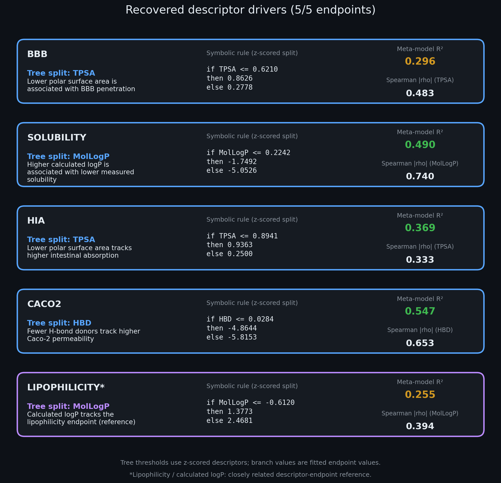
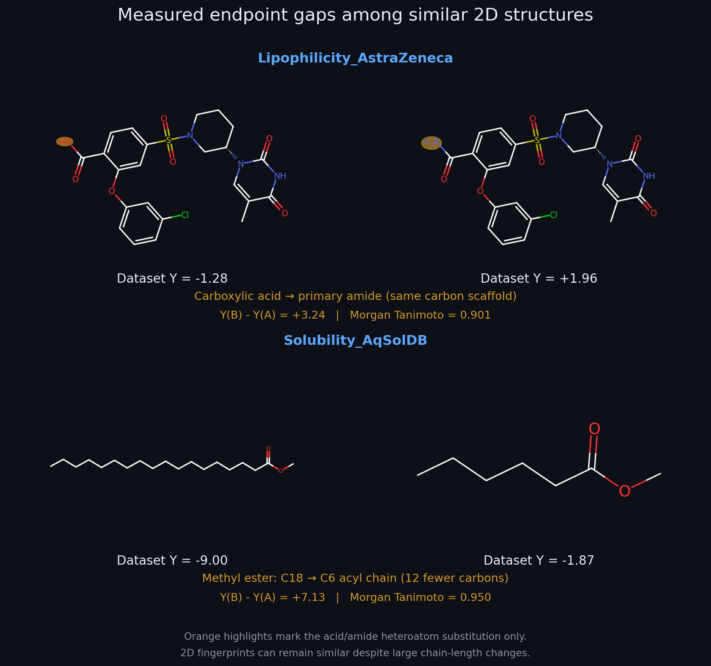
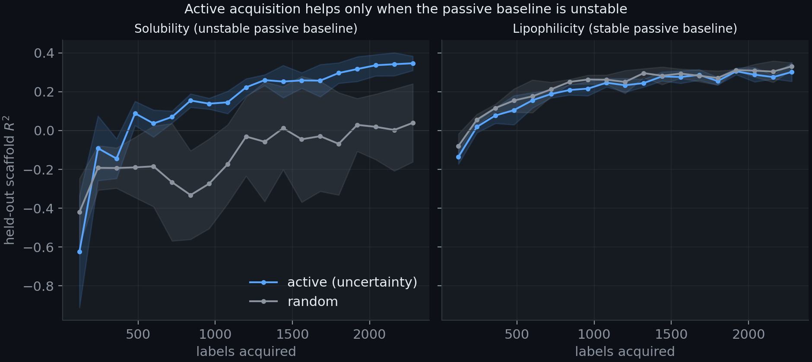

# Knowing what to measure and when to stop: an autonomous decision engine for molecular property discovery

Daniel R. Russell 
Autonomous Discovery Systems · Biomedical ML, SNPTX 
Correspondence: dan@snptx.ai

## Abstract

Molecular property discovery is bottlenecked by the cost of measurement and by a
trust gap: models rarely say how confident they are, or when enough has been measured
to make a call. We present a calibrated, autonomous, sequential decision engine that
turns ADMET property discovery into three coupled decisions and wires them into one
closed loop. First, it reaches go/no-go calls at matched nominal error rates with
materially fewer measurements using Wald's sequential probability ratio test (SPRT):
at the empirical operating point (a 0.25 sigma shift) it needs 65 versus 99
measurements (a 34% saving) and saves 23% on average across effect sizes, with mean
realized power 0.85 and Type I error 0.043 across the sweep. Second, it quantifies what
it does not know with split-conformal prediction evaluated under leakage-controlled
(Murcko scaffold) shift: empirical coverage is near, but for two of three endpoints
below, the nominal 0.90 target (BBB 0.884, hERG 0.869, AMES 0.899); BBB
random-split ECE is 0.044. Third, it abstains wisely: selective prediction lifts
retained accuracy from 0.864 to 0.94 at 70% coverage under both random and scaffold
splits. Wired into a closed loop with a pluggable oracle, a novelty archive, an
abductive discovery cycle, and DuckDB provenance, the engine runs an end-to-end
autonomous campaign that reaches six traceable go/no-go decisions using 140 versus
357 fixed-sample measurements (61% fewer); a companion discovery probe recovers an
established structure-property driver on five of five probed endpoints (four
independent drivers plus one closely related descriptor-endpoint reference) and
surfaces 1398 interpretable structure-property cliffs on its two regression endpoints.
All results are reproducible from a tagged commit on CPU.

## 1. Introduction

Two costs dominate early molecular discovery. The first is measurement: each assay
consumes material, time, and money, so deciding *how many* molecules to measure before
committing to a go/no-go call is itself a scientific decision. The second is trust: a
point prediction with no calibrated uncertainty cannot be safely acted upon, especially
under the distribution shift - that's the norm - when a program moves into novel chemical
scaffolds. Most modern ML-for-chemistry work optimizes predictive accuracy on a fixed test
set and stops there, leaving both costs unaddressed.

We take the complementary view that discovery is a *sequential decision problem under
calibrated uncertainty*. Our contribution is an engine that makes three coupled
decisions, (i) when to stop measuring, (ii) what it does not know, reported as
finite-sample-valid conformal sets whose coverage we then measure under scaffold
shift, and (iii) when to abstain on its least-confident cases, and that closes the
loop autonomously while logging a full provenance trail and producing interpretable,
checkable structure-property knowledge. We deliberately do not oversell active
learning: our hardening experiments show its benefit is regime-dependent, thus we
report it as such - a characterized decision rule - rather than a headline.

## 2. Related work and positioning

Sequential testing (Wald 1945; Wald & Wolfowitz 1948) and Bayesian experimental
design (Chaloner & Verdinelli 1995; Rainforth et al. 2024) provide the theory for
stopping early; conformal prediction (Vovk et al. 2005; Angelopoulos & Bates 2023)
provides distribution-free coverage; probability calibration (Guo et al. 2017) and
selective prediction (El-Yaniv & Wiener 2010; Geifman & El-Yaniv 2017) provide a
principled abstain rule; active learning (Settles 2012) and Bayesian optimization
(Frazier 2018) provide the acquisition rules we characterize rather than assume. Our
contribution is not a new estimator but a *wiring*: we compose these primitives around
a pluggable property oracle into an autonomous engine whose decisions are calibrated,
cheap, and traceable, and we validate each primitive on real ADMET data (Therapeutics
Data Commons; Huang et al. 2021) under leakage-controlled Murcko-scaffold splits
(Bemis & Murcko 1996).

## 3. Methods: the engine

The engine is a closed loop with a pluggable oracle `experiment_fn` (Figure 0). Its
components, all implemented in `src/` and cited below by their source module, are:

- **Oracle.** A calibrated property predictor. We use a GIN/GAT graph encoder
  (Xu et al. 2019; Velickovic et al. 2018; `src/models/gnn.py`) for deep-learning
  oracles, and a bootstrap/RandomForest oracle over RDKit descriptors and Morgan
  fingerprints (Rogers & Hahn 2010) for the CPU-reproducible campaign; both emit a
  metric and an uncertainty.
- **Calibration** (`src/safety/uncertainty.py`). Split-conformal prediction for
  coverage-guaranteed sets, temperature scaling + ECE for probability calibration
  (Guo et al. 2017), and MC-dropout / deep-ensemble variance for epistemic uncertainty
  (Gal & Ghahramani 2016; Lakshminarayanan et al. 2017).
- **Sequential stopping** (`src/intelligence/experiment_design.py`). Wald's SPRT tests
  H0: theta=theta_0 against H1: theta=theta_1 one measurement at a time, stopping at
  the first crossing of the log-likelihood-ratio boundaries `log(beta/(1-alpha))` and
  `log((1-beta)/alpha)`.
- **Surrogate + acquisition** (`src/intelligence/surrogate.py`). A GP (RBF +
  WhiteKernel) with EI/UCB/Knowledge-Gradient/Thompson acquisition (Frazier 2018) is
  the engine's general-purpose acquisition component. The value-of-active-learning
  study in Section 4.5 instead used the deep-ensemble oracle's predictive variance
  (K=3 query-by-committee) as the acquisition score, so that the acquisition and the
  oracle share one uncertainty model.
- **Novelty + abductive discovery** (`src/intelligence/scientific_discovery.py`). A
  kNN novelty archive and a discovery cycle that detects surprises (|z|>2), proposes
  abductive hypotheses, distills a meta-model, and extracts a symbolic-regression tree
  rule.
- **Lineage** (`src/intelligence/catalog.py`). A DuckDB experiment catalog storing per-
  decision parameters, metrics, surrogate predictions, and the discovered rule.

The schematic in Figure 0 depicts the CPU-reproducible campaign's RandomForest
descriptor oracle and decision flow; the GIN/GAT graph encoder is an alternative
pluggable oracle, not the one shown. Evaluation throughout uses Murcko-scaffold
cold splits (test scaffolds never seen in training), multi-seed repeats where the
oracle is stochastic, and 2000-resample bootstrap CIs on the active-learning
comparison.

<strong>Figure 0.</strong> System architecture of the CPU-reproducible sequential campaign. Molecular descriptors feed a RandomForest property oracle with split-conformal calibration; the decision engine combines sequential stopping, conformal uncertainty and selective prediction, and abductive discovery to make traceable go/no-go calls. Blue denotes inputs and feedback, neon yellow the oracle and calibration, green decisions and outputs, purple discovery, and grey DuckDB lineage. Module labels in the schematic (for example "§4.1 &middot; experiment_design.py") cite the Results subsection in which each component is evaluated; the matching derivations are in Appendix A.

## 4. Results

### 4.1 Sequential decision efficiency

Sweeping effect size from 0.15 to 0.90 sigma and simulating SPRT (300 runs per
effect size under each hypothesis) against the one-sided fixed-sample z-test at the
same nominal alpha=0.05 and beta=0.20, SPRT reaches a decision using fewer
measurements on average at every effect size. The *empirical operating point* is
taken from the data: the standardized mean shift of the top-tercile aromatic-ring-count
subgroup in the TDC lipophilicity set is 0.248 sigma, which we evaluate at the nearest
sweep point, 0.25 sigma. There SPRT needs **65.0 versus 98.9** measurements, a **34%**
saving; the mean saving across effect sizes is **23%**, with mean realized power
**0.85** and mean realized Type I error **0.043** across the sweep (Figure 1).

<strong>Figure 1.</strong> Sequential probability ratio test versus a one-sided fixed-sample z-test at matched nominal alpha=0.05, beta=0.20. The curves are the average sample number to a decision; the shaded band is the saving. At the empirical operating point (dashed line, 0.25 sigma; the lipophilicity high-aromatic subgroup shift) SPRT needs 65 versus 99 measurements. Realized error rates across the sweep: power 0.85, Type I 0.043.

### 4.2 Calibrated coverage under scaffold shift

Under leakage-controlled scaffold splits (calibration and test sets share no Murcko
scaffold), empirical split-conformal coverage at alpha=0.10 is **BBB 0.884, hERG
0.869, AMES 0.899** against a nominal 0.90 target; BBB and hERG fall below it. The
random-split values are 0.878, 0.909, and 0.897, respectively. The finite-sample
guarantee (Appendix A.2) requires exchangeable calibration and test scores, which a
scaffold-cold split deliberately breaks, so the scaffold numbers are a measured
robustness diagnostic rather than a guaranteed quantity: the shortfall is small
(0.1-3.1 points) but real. Probability calibration of the BBB oracle on the random
split is good, with **ECE 0.044** over ten equal-width bins (Figures 2 and 3).

<strong>Figure 2.</strong> Empirical split-conformal coverage under random and scaffold-cold splits. Scaffold coverage is 0.884 (BBB), 0.869 (hERG), and 0.899 (AMES); the dashed line marks the nominal 0.90 target, which is not a guarantee under shift.

<strong>Figure 3.</strong> BBB random-split reliability diagram. Expected calibration error is 0.0435 over ten equal-width confidence bins; only the five bins above 0.5 are populated because the confidence score is the maximum class probability of a binary classifier. The four upper bins sit close to the diagonal (slightly under-confident); the lowest populated bin (confidence about 0.54, accuracy about 0.34) is over-confident, but holds few molecules and so contributes little to the ECE.

### 4.3 Selective prediction

Abstaining on the least-confident molecules raises retained accuracy to **0.94** at 70%
coverage under both random and scaffold splits, up from a random-split base accuracy of
**0.864** (the scaffold split starts slightly higher, near 0.884, and reaches the same
level) (Figure 4).

<strong>Figure 4.</strong> Risk-coverage trade-off for the BBB oracle. Molecules are ranked by maximum class probability and the most-confident fraction (coverage) is retained. Retained accuracy rises monotonically from the full-coverage base (dotted line, 0.864 random split) to 0.94 at 70% coverage under both random and scaffold splits; the two curves track each other, so the confidence ranking survives scaffold shift even though coverage does not perfectly.

### 4.4 Autonomous, interpretable discovery

Fed real ADMET descriptors, the abductive discovery cycle recovers an established
structure-property driver on **5 of 5** probed endpoints - the five covered by the
discovery probe; the campaign in Section 4.6 spans an overlapping six-endpoint set. For
each endpoint the cycle fits a descriptor meta-model, distills a one-split regression
tree on z-scored descriptors, and checks the split feature (and the top Spearman
correlate) against the textbook driver. The recovered pairings are BBB -> TPSA
(meta-R2 0.30), solubility -> calculated logP (0.49), HIA -> TPSA (0.37), Caco2 -> HBD
(0.55), and a lipophilicity -> calculated-logP pairing (0.26) that we count as a
closely related descriptor-endpoint reference rather than an independent discovery:
four independent drivers plus one reference. On its two regression endpoints the cycle
also surfaces **1398** chemically valid structure-property cliffs (Morgan Tanimoto
0.70-0.99, |dY| >= 2; 1246 on solubility, 152 on lipophilicity) - for example,
methyl-ester chain-length contrasts on solubility and acid/amide contrasts on
lipophilicity. Figure 5 shows dataset lipophilicity extremes as endpoint context, not
matched cliff pairs; the recovered descriptor-rule cards are in Figure 6; and two
illustrative structure-property contrasts among similar 2D structures are in Figure 7.

<strong>Figure 5.</strong> Illustrative structures at the three lowest and three highest observed values in the TDC Lipophilicity_AstraZeneca set. The endpoint is the experimental octanol/water distribution coefficient at pH 7.4 (logD7.4), labelled logP in the panel for brevity. These are endpoint extremes, not matched activity-cliff pairs; the polar, ionizable or heavily hydrogen-bonding structures sit at the bottom and the lipophilic aryl systems at the top.

<strong>Figure 6.</strong> Recovered descriptor-rule cards, one per probed endpoint. Each row gives the one-split tree rule on the z-scored descriptor (threshold in standard-deviation units, branch values in endpoint units), the meta-model R2, and the absolute Spearman correlation of the split feature with the endpoint. Branch values show the direction of each association, for example lower TPSA -> higher BBB penetration and HIA, higher calculated logP -> lower aqueous solubility, fewer H-bond donors -> higher Caco-2 permeability. The lipophilicity calculated-logP pairing (purple) is a closely related descriptor-endpoint reference, not an independent driver discovery.

<strong>Figure 7.</strong> Two observed property contrasts among similar 2D structures. Top: a carboxylic acid and its primary amide on a shared scaffold (lipophilicity Y -1.28 vs +1.96; Morgan Tanimoto 0.901); because the endpoint is logD at pH 7.4, the ionized acid is far more hydrophilic than the neutral amide, so the gap is chemically expected. Bottom: C18 versus C6 methyl esters (solubility Y -9.00 vs -1.87 log mol/L; Tanimoto 0.950), where a twelve-carbon chain-length change barely moves a circular fingerprint but changes solubility by seven log units. These are measured associations that illustrate what a fingerprint-similarity cliff does and does not capture, not causal effects.

### 4.5 The value of active learning is regime-dependent

Under hardening (K=3 deep-ensemble query-by-committee acquisition vs random, scaffold
cold splits, 3 seeds, 18 rounds of 120 labels from a 120-label seed, 2000-resample
bootstrap CIs on the paired per-seed gap in area under the held-out-R2 learning
curve), uncertainty-driven acquisition beats random *only when the passive baseline is
unstable* (solubility: mean paired AULC gap +0.276, bootstrap CI [-0.102, +0.445],
not significant at n=3 seeds) and is significantly *negative* when the passive
baseline is stable (lipophilicity: gap -0.026, CI [-0.070, -0.022]). We therefore
report active learning as a characterized, regime-dependent decision rule, not a
headline win (Figure 8).

<strong>Figure 8.</strong> Label-efficiency curves (held-out scaffold R2 versus labels acquired; mean and seed range over 3 seeds). Left, solubility: the random baseline is unstable (wide band, negative R2 for most of the run) and uncertainty-driven acquisition climbs steadily above it, but the 3-seed bootstrap CI on the gap includes zero. Right, lipophilicity: the random baseline is stable and the active curve sits slightly but significantly below it. The benefit of active acquisition is regime-dependent.

### 4.6 End-to-end autonomous campaign

The wired engine runs a closed campaign across six ADMET endpoints (BBB, AMES, hERG,
solubility, Caco2, HIA). For each it trains a calibrated oracle on a leakage-controlled
scaffold-cold split, poses an a-priori go/no-go question (is the oracle's top-predicted
30% of held-out novel-scaffold molecules shifted from the pool baseline by at least 0.3
sigma?), measures that subgroup one molecule at a time in random order, stops via SPRT
(alpha=0.05, beta=0.20), runs the abductive discovery cycle, and logs the full lineage
to DuckDB. Two protocol details matter for reading the result. The direction of the
alternative is set from the realized sign of the subgroup mean, so the test is a
two-sided screen run at nominal alpha per side (realized Type I at most 2 alpha); and
the fixed-sample comparator is capped at the size of the available subgroup, because a
fixed design could not measure more molecules than exist (hERG 49, HIA 33; the other
four endpoints use the uncapped 68.7).

Across the campaign the engine reaches a decision in **140 measurements versus the
357** a fixed-sample design would require, a **61% saving**, returning **6 GO
decisions**, each traced to its calibrated oracle and a recovered descriptor
association (meta-R2 0.14-0.55): BBB->TPSA, AMES->aromatic-ring count,
hERG->heavy-atom count, solubility->calc logP, Caco2->HBD, HIA->TPSA. Six GO verdicts
and no NO-GO is the expected outcome when every oracle carries real signal, since the
subgroup under test is the oracle's own top-ranked set; a NO-GO would have flagged an
oracle that fails to separate its top predictions from the pool. For AMES and hERG -
endpoints the discovery probe did not cover - the recovered split is a descriptor
association rather than an established mechanistic driver. The savings are largest
where the observed shift is large (solubility 0.79 sigma, 10 measurements; Caco2 0.70
sigma, 17) and smallest where it is modest (BBB 0.43 sigma, 38); for HIA (0.43 sigma)
the SPRT reached its boundary only on the 33rd and final available molecule, so it
matches the capped fixed-sample budget (33 vs 33) and saves nothing. The campaign
oracles' conformal coverage spans 0.85 (HIA) to 0.97 (hERG) at the 0.90 target
(Figure 10), reflecting the small scaffold-cold test sets. Every decision is
reproducible and provenance-logged. The campaign timeline, with the SPRT budget
staying at or below fixed-sample and a running measurements-saved counter, is Figure 9;
the task-to-oracle-to-decision-to-rule lineage graph is Figure 10. The raw provenance
is in `e8_campaign_lineage.duckdb` and the roll-up in `e8_campaign_results.json`.

<strong>Figure 9.</strong> End-to-end autonomous campaign timeline. Top: cumulative measurements as the six decisions are made in order (BBB, AMES, hERG, solubility, Caco2, HIA); the SPRT path (blue) stays at or below the fixed-sample requirement (grey), with the fixed-sample step for hERG and HIA capped at the available subgroup size. Bottom: the running measurements-saved counter, ending at 217 of 357 (61%). The HIA step adds nothing because SPRT used the whole subgroup.

<strong>Figure 10.</strong> Campaign lineage matrix. Each row connects an endpoint and DuckDB record ID to its oracle check (conformal coverage and retained accuracy at 70% coverage for classification endpoints; test R2 and mean predictive uncertainty for regression endpoints), its SPRT decision and measurement budget, and the discovered one-split rule with its meta-model R2. Coverage ranges from 0.85 (HIA) to 0.97 (hERG) at the 0.90 target.

## 5. Reproducibility

Every number regenerates on CPU from the committed probes: `feasibility_and_figures.py`
and `pivot_probes.py` (Sections 4.1, 4.2, 4.3, and 4.5), `e7_discovery_probe.py` with
`e7_render.py` (Section 4.4), `e8_campaign.py` (Section 4.6), and
`architecture_figure.py` (Figure 0). The interpreter is pinned (3.11.2); seeds,
environment, and TDC data versions are fixed; the DuckDB lineage store is emitted per
run. Figure files are numbered as in this manuscript. The deep-ensemble curves behind
Figure 8 were trained on GPU and are committed as `g1_harden_curves.npz`; rendering
them needs no GPU. The companion notebook
`notebooks/walkthrough_calibrated_sequential_discovery.ipynb` recomputes the SPRT
operating characteristics, the conformal coverage, and the selective-prediction numbers
live from the committed artifacts.

## 6. Limitations

- Retrospective simulation over public libraries; no wet-lab loop is closed.
- Conformal coverage is guaranteed only under exchangeability; under scaffold shift we
  report measured coverage, which fell below target on two of three endpoints
  (Section 4.2). Shift-weighted conformal methods are not applied.
- The campaign's go/no-go test sets its direction from the realized subgroup mean and
  tests the oracle's own top-ranked subgroup (Section 4.6); the realized Type I error
  is therefore bounded by 2 alpha, not alpha, and six GO calls say that the oracles
  carry signal, not that any particular chemistry is validated. A pre-registered
  direction would restore the one-sided rate.
- Uncertainty-driven label acquisition is regime-dependent (Section 4.5) and was
  assessed on two regression endpoints with three seeds; we make no task-general
  acquisition claim.
- SPRT efficiency assumes an approximately Gaussian per-measurement model with known
  sigma, and the campaign draws measurements without replacement from a finite
  subgroup; we report realized operating characteristics, not only the theoretical
  bound.
- One data family per task; multi-assay transfer is future work.
- Drift monitoring and substructure-level uncertainty attribution did not pass a cheap
  feasibility probe and are scoped as additional future work.

## 7. Conclusion

Treating molecular property discovery as a calibrated sequential decision problem
yields an engine that reaches go/no-go calls at matched nominal error rates with fewer
measurements, reports calibrated uncertainty whose behaviour under scaffold shift is
measured rather than assumed, abstains on its least-confident cases, and produces
traceable, interpretable discoveries. The primitives are
individually classical; the contribution is a validated, reproducible composition of
them into a single autonomous decision engine.

## Generative AI Disclosure

Some assertions and model development steps within this document were developed with
reference to Generative AI tools (Copilot; 2026 version). AI assistance was used for
clarifying concepts, validating code logic, identifying potential errors, and
generating some code segments. All AI-generated material was independently reviewed,
debugged, and validated for correctness before inclusion.

## References

1. Wald, A. (1945). Sequential tests of statistical hypotheses. *Annals of
   Mathematical Statistics*, 16(2), 117-186.
2. Chaloner, K. & Verdinelli, I. (1995). Bayesian experimental design: a review.
   *Statistical Science*, 10(3), 273-304.
3. Rainforth, T., Foster, A., Ivanova, D. R. & Bickford Smith, F. (2024). Modern
   Bayesian experimental design. *Statistical Science*, 39(1), 100-114.
4. Settles, B. (2012). *Active Learning*. Synthesis Lectures on AI and ML, Morgan &
   Claypool.
5. Vovk, V., Gammerman, A. & Shafer, G. (2005). *Algorithmic Learning in a Random
   World*. Springer.
6. Angelopoulos, A. N. & Bates, S. (2023). Conformal prediction: a gentle
   introduction. *Foundations and Trends in Machine Learning*, 16(4), 494-591.
7. Guo, C., Pleiss, G., Sun, Y. & Weinberger, K. Q. (2017). On calibration of modern
   neural networks. *ICML*.
8. Gal, Y. & Ghahramani, Z. (2016). Dropout as a Bayesian approximation:
   representing model uncertainty in deep learning. *ICML*.
9. Lakshminarayanan, B., Pritzel, A. & Blundell, C. (2017). Simple and scalable
   predictive uncertainty estimation using deep ensembles. *NeurIPS*.
10. El-Yaniv, R. & Wiener, Y. (2010). On the foundations of noise-free selective
    classification. *JMLR*, 11, 1605-1641.
11. Geifman, Y. & El-Yaniv, R. (2017). Selective classification for deep neural
    networks. *NeurIPS*.
12. Xu, K., Hu, W., Leskovec, J. & Jegelka, S. (2019). How powerful are graph neural
    networks? *ICLR*.
13. Velickovic, P., Cucurull, G., Casanova, A., Romero, A., Lio, P. & Bengio, Y.
    (2018). Graph attention networks. *ICLR*.
14. Huang, K., Fu, T., Gao, W., et al. (2021). Therapeutics Data Commons: machine
    learning datasets and tasks for drug discovery and development. *NeurIPS Datasets
    and Benchmarks*.
15. Bemis, G. W. & Murcko, M. A. (1996). The properties of known drugs. 1. Molecular
    frameworks. *Journal of Medicinal Chemistry*, 39(15), 2887-2893.
16. Guha, R. & Van Drie, J. H. (2008). Structure-activity landscape index: identifying
    and quantifying activity cliffs. *Journal of Chemical Information and Modeling*,
    48(3), 646-658.
17. Wald, A. & Wolfowitz, J. (1948). Optimum character of the sequential probability
    ratio test. *Annals of Mathematical Statistics*, 19(3), 326-339.
18. Tibshirani, R. J., Foygel Barber, R., Candès, E. & Ramdas, A. (2019). Conformal
    prediction under covariate shift. *NeurIPS*.
19. Rogers, D. & Hahn, M. (2010). Extended-connectivity fingerprints. *Journal of
    Chemical Information and Modeling*, 50(5), 742-754.
20. Frazier, P. I. (2018). A tutorial on Bayesian optimization. *arXiv:1807.02811*.

---

# Appendix A. Methods and derivations

Notation: each result below is implemented in the cited module and exercised by the
committed probes. We give the derivation, the operative assumptions, and the point in
the code where the quantity appears.

## A.1 Wald's sequential probability ratio test (SPRT)

**Model.** Observations $x_1, x_2, \dots$ are i.i.d. $\mathcal{N}(\theta, \sigma^2)$
with known $\sigma$. We test $H_0:\theta=\theta_0$ against $H_1:\theta=\theta_1$
(w.l.o.g. $\theta_1>\theta_0$); here $\theta$ is a standardized per-measurement signal
and $\theta_1-\theta_0$ is the "meaningful effect."

**Per-sample log-likelihood ratio.** With
$\log f_\theta(x) = -\frac{(x-\theta)^2}{2\sigma^2} + \text{const}$,

$$
z_i \;=\; \log\frac{f_{\theta_1}(x_i)}{f_{\theta_0}(x_i)}
\;=\; \frac{1}{2\sigma^2}\big[(x_i-\theta_0)^2-(x_i-\theta_1)^2\big]
\;=\; \frac{\theta_1-\theta_0}{\sigma^2}\Big(x_i-\frac{\theta_0+\theta_1}{2}\Big).
$$

This is exactly the increment accumulated in `experiment_design.py::SPRT.update`.

**Decision rule.** Let $\Lambda_n=\sum_{i=1}^n z_i$. Continue while $B<\Lambda_n<A$;
accept $H_1$ once $\Lambda_n\ge A$, accept $H_0$ once $\Lambda_n\le B$, with

$$
A=\log\frac{1-\beta}{\alpha}, \qquad B=\log\frac{\beta}{1-\alpha},
$$

the code's `_upper` and `_lower`. Wald's inequalities bound the realized error rates,
$\alpha'\le \alpha/(1-\beta)$ and $\beta'\le \beta/(1-\alpha)$, and jointly
$\alpha'+\beta'\le\alpha+\beta$. The bounds hold with equality only if $\Lambda_n$
lands exactly on a boundary; in practice the random walk overshoots, which makes the
realized rates typically **conservative**. Our realized type-I error across the sweep
(0.043) sits below the nominal 0.05, consistent with this, although the inequalities
alone would permit $\alpha'$ up to $0.0625$.

**Efficiency.** For the same $(\alpha,\beta)$ the fixed-sample size at effect
$\delta=(\theta_1-\theta_0)/\sigma$ is
$n_{\text{fix}}=\big((z_{1-\alpha}+z_{1-\beta})/\delta\big)^2$. Using Wald's
overshoot-free approximation the average sample number is

$$
E_\theta[N]\;\approx\;\frac{L(\theta)\,B+\big(1-L(\theta)\big)\,A}{E_\theta[z]},
\qquad E_\theta[z]=\frac{\theta_1-\theta_0}{\sigma^2}\Big(\theta-\frac{\theta_0+\theta_1}{2}\Big),
$$

where $L(\theta)=P(\text{accept }H_0\mid\theta)$ is the operating characteristic.
$E_\theta[z]=0$ at the least-favorable point $\theta=(\theta_0+\theta_1)/2$, where $N$
peaks. Wald & Wolfowitz (1948) proved the SPRT **minimizes** $E[N]$ among all tests
with error rates no larger than $(\alpha,\beta)$; Section 4.1 measures the realized
$E[N]<n_{\text{fix}}$ across effect sizes (65 vs 99 at the empirical operating point).

**Assumptions / practice.** i.i.d., Gaussian, known $\sigma$. We estimate $\sigma$
from the pool and report *realized* power and type-I from simulation rather than only
the asymptotic bound; overshoot keeps the bounds conservative.

## A.2 Split-conformal prediction

**Construction.** Given a calibration sample $\{(X_i,Y_i)\}_{i=1}^n$ and a
nonconformity score $s(x,y)$ (we use $s=1-\hat p_y(x)$, one minus the model's
probability on the true label), compute $s_i=s(X_i,Y_i)$ and the threshold

$$
\hat q=\text{the }\big\lceil (n+1)(1-\alpha)\big\rceil\text{-th smallest of }\{s_i\}_{i=1}^n,
$$

then predict the set $C(x)=\{y: s(x,y)\le \hat q\}$
(`safety/uncertainty.py::calibrate_conformal`).

**Finite-sample coverage.** If the $n+1$ scores $s_1,\dots,s_n,s_{n+1}$ are
exchangeable, the rank of $s_{n+1}$ is uniform on $\{1,\dots,n+1\}$, so

$$
P\big(Y_{n+1}\in C(X_{n+1})\big)=P\big(s_{n+1}\le\hat q\big)
\;\ge\;\frac{\lceil (n+1)(1-\alpha)\rceil}{n+1}\;\ge\;1-\alpha,
$$

distribution-free (Vovk et al. 2005). At $\alpha=0.10$ this is the 0.90 target of Section 4.2.

**Scaffold-shift limitation.** For the scaffold-cold evaluation, whole scaffolds
are reserved for test; calibration uses molecules from the remaining scaffolds.
Calibration and test scores therefore need not be exchangeable, and the
finite-sample guarantee above cannot be assumed for the shifted test set.
Section 4.2 reports measured coverage as a robustness diagnostic, not a
conditional coverage guarantee. We do **not** apply covariate-shift-weighted
conformal (Tibshirani et al. 2019).

## A.3 Selective prediction (risk-coverage)

With a confidence score $g(x)=\max_y\hat p_y(x)$, the selective classifier abstains
when $g(x)<\tau$. Define coverage $\phi(\tau)=P(g(X)\ge\tau)$ and selective risk
$R(\tau)=E[\ell(\hat f(X),Y)\mid g(X)\ge\tau]$. If $g$ ranks points by their true
probability of correctness, $R(\tau)$ is non-increasing as $\tau$ rises (coverage
falls): the monotone risk-coverage trade-off (El-Yaniv & Wiener 2010). Retained
accuracy $1-R$ rises from 0.864 at full coverage to 0.94 at coverage 0.70; that is,
abstaining on the least-confident 30% removes a disproportionate share of errors,
which requires that $g$ rank errors better than chance (observed under both splits,
Section 4.3). The 0.864 base is the random-split value; the scaffold split starts near
0.884 and reaches the same retained accuracy at 0.70 coverage.

## A.4 Calibration error (ECE)

Partitioning predictions into $M$ equal-width confidence bins $\{B_m\}$,

$$
\text{ECE}=\sum_{m=1}^{M}\frac{|B_m|}{N}\,\big|\mathrm{acc}(B_m)-\mathrm{conf}(B_m)\big|,
$$

reported at $M{=}10$ (BBB, random split; ECE 0.044). With $\mathrm{conf}=\max_y\hat p_y$
on a binary task only the bins above 0.5 can be populated, so five of the ten bins
carry mass (Figure 3). Temperature scaling (Guo et al. 2017), a single scalar $T$
minimizing validation NLL on the logits, is available in `uncertainty.py` for
probability recalibration.

## A.5 Structure-activity landscape index (cliffs)

For a molecule pair $(i,j)$ with ECFP4 (Rogers & Hahn 2010) Tanimoto similarity
$\text{sim}_{ij}$ and property gap $|\Delta Y_{ij}|$,

$$
\text{SALI}_{ij}=\frac{|\Delta Y_{ij}|}{1-\text{sim}_{ij}}
$$

(Guha & Van Drie 2008). Section 4.4 surfaces pairs with $\text{sim}\ge0.70$ and
$|\Delta Y|\ge2$, excluding $\text{sim}\ge0.999$ (ECFP collisions on non-identical
graphs). A high SALI indicates high fingerprint similarity with a large observed
property difference; it does not establish a single structural edit or causation.

## A.6 Reproducibility of the oracle (CPU vs GPU)

Every quantity above is computed with a CPU oracle (bootstrap / random-forest over
RDKit descriptors and Morgan fingerprints) so the decision logic reproduces without a
GPU. The GIN/GAT graph oracle (`models/gnn.py`) is a pluggable alternative; its
deep-ensemble form was trained on GPU only for the acquisition study of Section 4.5,
whose curves are committed. No headline number depends on GPU training.
