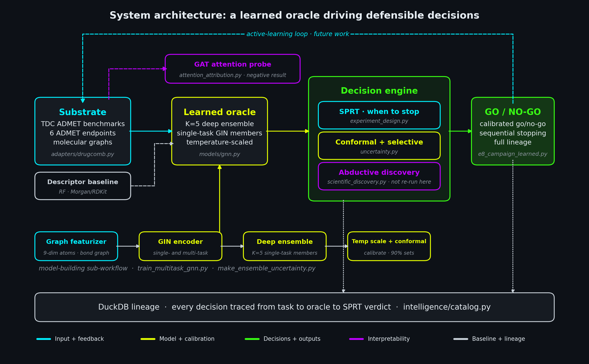
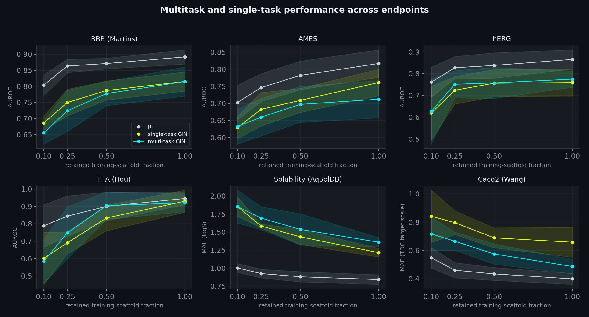
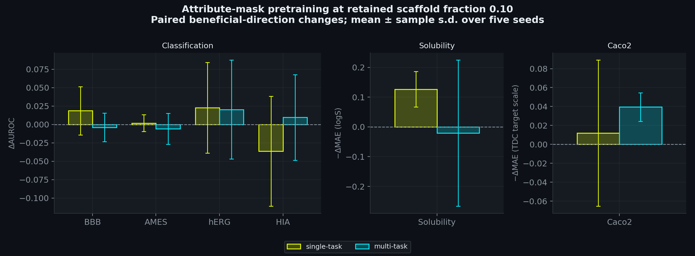
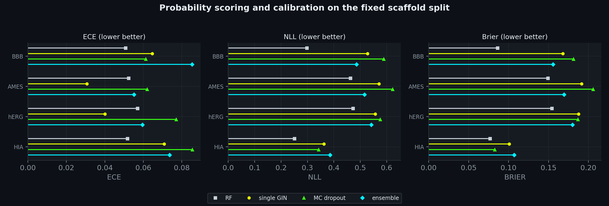
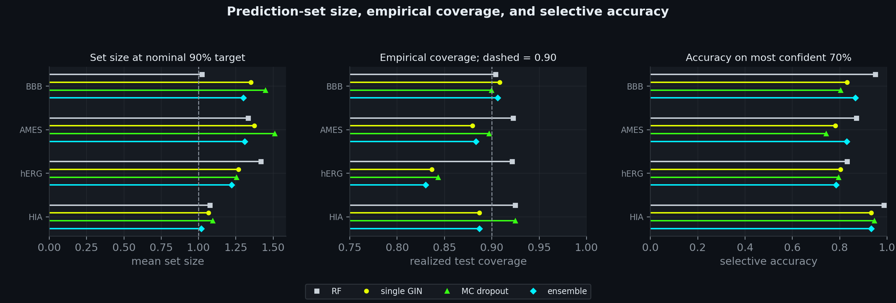
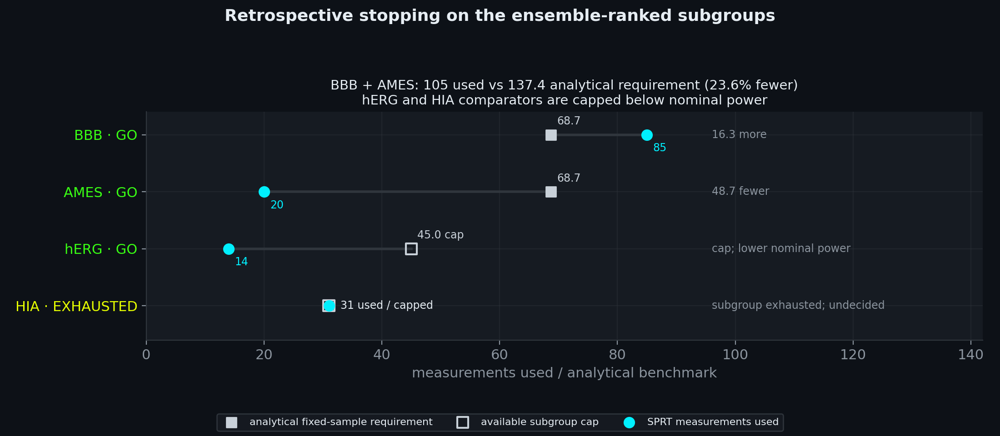
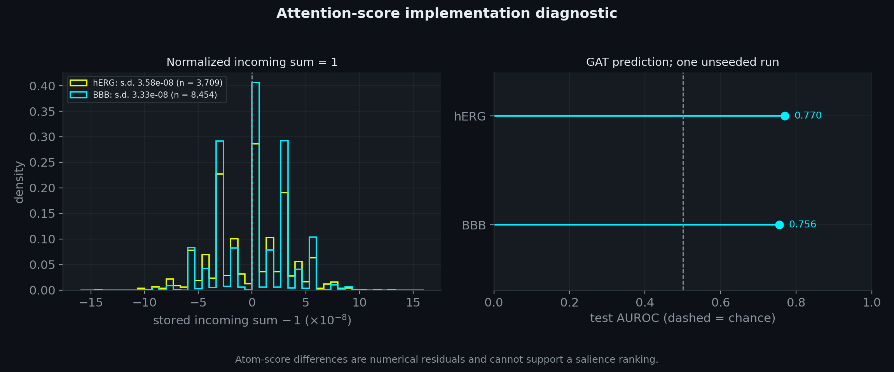

# Molecular graph models for ADMET: multitask comparisons, ensemble probabilities, and retrospective sequential testing

Daniel R. Russell<br>
Autonomous Discovery Systems · Biomedical ML, SNPTX<br>
Correspondence: dan@snptx.ai

## Abstract

A companion study built a sequential decision engine around a random-forest oracle. This
paper asks what learned graph models add when they take the oracle's place, and answers by
audit as much as by benchmark. On six Therapeutics Data Commons ADMET endpoints, under
within-endpoint Murcko scaffold splits repeated over five seeds and four retained
training-scaffold fractions, a multi-task Graph Isomorphism Network lowers Caco2 MAE by
0.11 to 0.17 relative to its single-task counterpart (18 of 20 seed-fraction pairs) and
lifts HIA AUROC by 0.071 at fraction 0.50 (5 of 5 seeds); at full data it loses ground on
AMES and Solubility (AUROC −0.049, MAE +0.145). We read these as comparisons of training
protocols rather than measurements of transfer, because multi-task training recycles the
smaller task loaders and, since splits are drawn per endpoint, the shared trunk trains on
structures identical to 10-23% of each target's test records at full data. Turning from
accuracy to uncertainty, a five-member temperature-scaled ensemble has the lowest
graph-model NLL on one fixed classification split (0.482 against 0.505 for a single network
and 0.532 for Monte Carlo dropout) and the lowest AURC, but a higher ECE; the descriptor
random forest leads on accuracy and on most uncertainty metrics. The ensemble's nominal 90%
prediction sets cover 0.877 of test labels on average, a figure we report as empirical
rather than guaranteed, since temperature fitting reuses the conformal calibration labels
and group splitting does not establish molecule-level exchangeability. Wired into the
engine, a probability-ranked SPRT replay reaches GO on BBB and AMES after 105 measurements
against an analytic fixed-sample budget of about 137.4; it runs under a Gaussian working
model, standardizes with test-pool statistics, and sees one measurement order, so what it
demonstrates is traceability, not prospective error control. Finally, an audit of a GAT
attribution probe finds its atom score equal to one by softmax normalization, and we
withdraw the salience interpretation. An executable walkthrough reconstructs every reported
table from committed artifacts; retraining is a separate GPU tier.

## 1. Introduction

Two costs dominate early molecular discovery. The first is measurement: each assay consumes
material, time, and money, so deciding how many molecules to measure before committing to a
go/no-go call is itself a scientific decision. The second is trust: a point prediction
without an uncertainty assessment gives little guidance about how far a decision can lean on
it, least of all when a program moves into new chemical scaffolds.

A companion study (Russell 2026) addressed both costs with a calibrated sequential decision
engine. Wald's sequential probability ratio test decides when to stop measuring,
split-conformal and selective prediction quantify what the oracle doesn't know, and every
decision is logged to a provenance store. That engine ran on a random-forest (RF) oracle over
molecular fingerprints, and its calibration-and-stopping layer was built to accept any oracle
that emits class probabilities. The natural next question is what happens when a learned
graph model takes the oracle's place. This paper asks it.

The question comes with a known complication. Yang et al. (2019) found strong aggregate
performance for learned molecular representations, yet fingerprint models stayed competitive
on smaller datasets; Jiang et al. (2021), using random splits, found that the ranking of
descriptor and graph models depended on the endpoint. So we keep a strong descriptor
comparator in every table and report the splitting protocol explicitly. If learned
representations earn their place here, it will more likely be through properties a tabular
model lacks: a representation that can be shared across related endpoints, and uncertainty
that improves under ensembling. We test both, and we test the engine with the result.

**Contributions.**

1. A paired comparison of multi-task and single-task GIN across six ADMET endpoints, four
   retained training-scaffold fractions, and five split seeds, reported with seed-level
   dispersion and with the training-exposure confounds named rather than assumed away (§4.1).
2. A pretraining ablation asking whether self-supervised attribute masking (Hu et al. 2020)
   changes supervised performance. Across 36 tested cells, no comparison survives Holm
   correction; we are careful to say this is not a finding of equivalence (§4.2).
3. A comparison of graph-model uncertainty methods (single network, Monte Carlo dropout, deep
   ensemble) against the RF on calibration, conformal efficiency, and selective prediction
   under scaffold shift (§4.3-§4.4).
4. The ensemble wired into the companion engine's sequential go/no-go campaign, with every
   decision logged (§4.5), and a diagnostic showing why the implemented attention statistic
   cannot test atom-salience alignment (§4.6).
5. A measurement of how much of each endpoint's test set the multi-task trunk sees through
   the other endpoints' training data (Appendix A.10), which fixes how far the transfer
   results can be read.

**What we claim, and what we don't.** Stated up front so the results can be read without
suspicion. We don't claim that graph models beat the descriptor baseline on accuracy; the RF
leads on every endpoint at full data. We don't claim that the ensemble is the best-calibrated
model by expected calibration error; it isn't. Scaffold splits are drawn within each endpoint,
and multi-task training changes both structural exposure and target-task update counts, so
the transfer comparison is a protocol comparison. The uncertainty results come from one fixed
split; the ensemble's conformal construction reuses its calibration labels; the campaign is a
retrospective replay that uses test-pool statistics; and the attention result is an
implementation diagnostic. Each of these boundaries is restated where it bites and collected
in §6.

## 2. Related work and positioning

Graph neural networks learn representations directly from molecular graphs (Gilmer et al.
2017; Kipf and Welling 2017; Velickovic et al. 2018; Xu et al. 2019), and benchmarks such as
MoleculeNet (Wu et al. 2018) have pushed the field toward careful evaluation protocols and
strong conventional baselines. The accuracy question is unsettled in a specific way: Yang et
al. (2019) report competitive learned representations whose advantage depends on dataset
size and splitting strategy, and Jiang et al. (2021) compare models under random splitting
and find the ordering endpoint-specific. Neither supports a blanket claim that graph models
outperform descriptors, which is why we evaluate endpoint by endpoint. Multi-task learning
shares statistical strength across related tasks (Caruana 1997); in drug discovery,
massively multi-task networks improve with more tasks and more data, though the gains vary
by task (Ramsundar et al. 2015). Self-supervised pretraining of graph networks can help or
hurt depending on the objective, and node-level objectives alone can transfer negatively
(Hu et al. 2020).

On the uncertainty side, deep ensembles (Lakshminarayanan et al. 2017) and temperature
scaling (Guo et al. 2017) are the standard routes to calibrated deep uncertainty, with Monte
Carlo dropout (Gal and Ghahramani 2016) the usual single-model baseline. One detail turns out
to matter for us: whether ensemble members are calibrated before or after averaging, since
averaging individually calibrated members tends to leave the ensemble underconfident (Rahaman
and Thiery 2021; Wu and Gales 2021). Split-conformal prediction (Vovk et al. 2005;
Angelopoulos and Bates 2023) gives distribution-free marginal coverage when the fitted score
function is independent of the calibration labels and the calibration and test scores are
exchangeable; covariate shift can break the ordinary construction, and the weighted remedies
need suitable density-ratio assumptions (Tibshirani et al. 2019). Selective prediction
(El-Yaniv and Wiener 2010; Geifman and El-Yaniv 2017) supplies a principled abstention rule.
The sequential probability ratio test (Wald 1945) minimizes expected sample size for simple
hypotheses under the specified independent sampling model, among tests with no larger error
probabilities (Wald and Wolfowitz 1948). Whether attention weights explain predictions is
contested (Jain and Wallace 2019; Wiegreffe and Pinter 2019).

Our contribution isn't a new estimator. It is a scaffold-split measurement, on real ADMET
data, of three things: how multi-task and single-task training protocols differ, how good
the resulting probabilities and prediction sets are, and how an existing sequential engine
behaves when an ensemble supplies its ranking. The campaign does not compare decision
performance against RF, single-network, or MC-dropout rankings; that comparison is a next
step, not a result here.

## 3. Methods

Figure 0 places the components in one pipeline. The learned oracle takes the place of the
companion study's RF oracle; the RF stays on as a descriptor comparator; and the decision
engine is reused unchanged. The engine's abductive rule-discovery component belongs to the
companion study and isn't re-run here.

<p align="center"></p>

<sub><strong>Figure 0.</strong> System architecture. Six endpoints support the single-task and multi-task GIN comparison. For the four classification endpoints, K = 5 single-task members are temperature-scaled individually before their probabilities are averaged. The RF descriptor model is a separate comparator. Prediction-set and selective metrics are evaluated alongside the probability-ranked retrospective SPRT campaign and recorded with its decisions; they do not control stopping. The GAT diagnostic is separate from this decision path. Blue marks inputs, yellow learned models and calibration, green decisions and outputs, purple diagnostics, and grey the RF comparator and lineage. The dashed active-learning loop is future work.</sub>

### 3.1 Data and scaffold splits

We use six Therapeutics Data Commons ADMET endpoints (Huang et al. 2021): BBB (Martins et al.
2012), AMES (Xu et al. 2012), hERG (Wang et al. 2016a), and HIA (Hou et al. 2007) as binary
classification, and Solubility (Sorkun et al. 2019) and Caco2 (Wang et al. 2016b) as regression,
with 2030, 7278, 655, 578, 9982, and 910 featurized records respectively. Those are record
counts rather than counts of unique compounds: canonical SMILES identify 1975, 7255, 648, 578,
9982, and 906 distinct structures. We keep repeated structures, including a few with
differing labels, and applied no deduplication or relabeling in this revision. MAE is
reported on each dataset's supplied target scale after reversing training-set
standardization.

Every split is a Murcko scaffold cold-split (Bemis and Murcko 1996). Unique scaffolds are
randomly permuted and assigned whole to test (20% of scaffolds), validation (20%), and
training, so within an endpoint no test or validation scaffold is seen in training. The
word *within* carries weight. Splits are drawn independently for each endpoint, and a model
that trains on several endpoints at once, as the multi-task trunk and the pretraining corpus
do, therefore also sees the other endpoints' training molecules. Some of those share a
scaffold with the target endpoint's test molecules; some are the same molecule. Appendix A.10
measures how many.

Fractions $f = 0.10, 0.25, 0.50, 1.00$ retain that fraction of the available training
scaffolds, subject to integer rounding. Because scaffold groups vary enormously in size, $f$
is neither a record fraction nor a label budget: Solubility at $f = 0.10$, seed 1, retains
3330 of 7938 full-training records (42.0%). The transfer and pretraining studies repeat
everything over five seeds (0-4), each drawing a new split and initialization; the
uncertainty study and the campaign use one fixed split (seed 0). Apart from checkpoint
selection in the attention diagnostic (§3.8), the validation set serves only temperature
scaling and conformal calibration, and reusing its labels for both steps has a
conformal-validity consequence we return to in §3.6. Supervised GIN models train for a fixed
150 epochs with no early stopping.

### 3.2 Featurization and graph encoder

Each molecule is a graph with nine atom features (atomic number as a scalar, degree, formal
charge, explicit hydrogen count, aromatic and ring flags, and a one-hot sp/sp2/sp3
hybridization), from `src/adapters/drugcomb.py`. The featurizer also computes three bond
attributes (bond order, conjugation, ring membership), but the GIN used here aggregates over
bond connectivity only and ignores them; only the edge-conditioned GINE variant, not used in
this study, would consume them. The encoder is a Graph Isomorphism Network (GIN; Xu et al. 2019)
from `src/models/gnn.py`, with four message-passing layers, hidden width 128, two-layer MLPs
with batch normalization inside each GIN MLP and again after each convolution, sum pooling,
and per-graph PairNorm (Zhao and Akoglu 2020) between layers. DropEdge (Rong et al. 2020)
independently drops directed edge entries at rate 0.1 during training; the two directions of
a bond are not forced to share a mask.

### 3.3 Multi-task objective and training

The multi-task model shares one encoder trunk across all six endpoints and attaches a head
per endpoint: two logits for classification, one output for regression. Regression targets
are standardized per endpoint on the training split, which narrows the differences in target
scale without equalizing loss magnitudes or gradients. Training visits endpoints round-robin
with unit task weights and inverse-frequency classification weights.

One scheduling detail shapes how Table 1 must be read. Each multi-task epoch contains as many
rounds as the largest task loader has batches, and smaller loaders restart when exhausted,
whereas single-task training traverses its own loader once per epoch. The smaller the
endpoint, the more repeated target-task updates it receives under multi-task training: at
full data, seed 0, HIA receives 7650 updates versus 450, and Caco2 7650 versus 750. Equal
epoch counts and a shared architecture therefore don't isolate parameter sharing. Appendix
A.1 writes out the objective and this exposure confound. All graph models use Adam (learning
rate 5e-4, weight decay 5e-4, batch size 128); Appendix A.9 collects the settings.

### 3.4 Descriptor baseline

The RF baseline sees ten RDKit physicochemical descriptors (molecular weight, cLogP, TPSA,
hydrogen-bond donors and acceptors, rotatable bonds, aromatic rings, fraction sp3, heavy
atoms, ring count) concatenated with a 1024-bit Morgan fingerprint of radius 2 (Rogers and
Hahn 2010), and uses 300 trees with balanced class weights for classification. It is an
adapted comparator rather than the companion campaign's RF, which used Morgan fingerprints
alone, unweighted classes, and different split proportions.

### 3.5 Deep ensemble and uncertainty baselines

For the four classification endpoints we train K = 5 single-task GIN members on the fixed
split with different training seeds, which vary the initialization, minibatch order, and
dropout and DropEdge masks; all members share one test set. Each member's logits are
temperature-scaled on the validation set by minimizing NLL (Guo et al. 2017), and the
ensemble probability is the mean of the scaled member probabilities. Two single-model
baselines sit beside it. The single-network baseline is member 0 with its own temperature.
The Monte Carlo dropout baseline averages 30 stochastic passes of member 0 in training mode,
and in this implementation training mode also switches on DropEdge and batch-statistics
normalization; its probabilities aren't temperature-scaled (§6). The RF probabilities are
used as produced. Appendix A.2 gives the ensemble's uncertainty decomposition.

### 3.6 Decision metrics

Calibration is scored by top-label expected calibration error (ECE) over ten equal-width
bins, negative log-likelihood (NLL), and the Brier score. Split-conformal prediction
(`src/safety/uncertainty.py`) uses the score $1-\hat p(y\mid x)$, calibrated on the validation
set at a nominal 90% target; we report mean set size and realized test coverage together,
because one without the other misleads. Selective prediction ranks test molecules by maximum
class probability, and we report the area under the risk-coverage curve (AURC) and accuracy
on the most confident 70%. Appendices A.5-A.7 give the definitions.

Here the label-reuse consequence promised in §3.1 arrives. For the single GIN and the
ensemble, the validation labels that calibrate the conformal threshold also fit the
temperatures. A single binary network survives this: a common scalar temperature preserves
score ranks and so leaves the exact order-statistic sets unchanged (Appendix A.5). The
ensemble does not get the same exemption, since fitting different member temperatures before
averaging is not a common monotone transformation of a fixed score. On top of that, and for
every method including the RF, the group-based split leaves molecule-level score
exchangeability unestablished. We therefore report coverage as an empirical quantity
throughout.

### 3.7 Sequential go/no-go campaign

The campaign reuses the companion engine's decision logic with the ensemble as oracle
(`e8_campaign_learned.py`). For each classification endpoint, test molecules are ranked by
the ensemble's probability of the positive class and the top 30% form the candidate
subgroup. Labels are standardized with the mean and standard deviation of the full test
pool, and the subgroup's standardized labels are revealed one at a time in a random order.
Wald's SPRT tests $H_0:\theta=0$ against $H_1:\theta=0.30$ (in pool standard deviations) at
$(\alpha,\beta)=(0.05,0.20)$, with the test direction set by the sign of the whole
subgroup's mean. Conformal and selective metrics are logged alongside the outcomes but
gate neither selection nor stopping, and no alternative oracle is run on the same pool.

Two of those choices look ahead. The standardization and the direction both use labels a
real campaign would not yet have measured, which is why we call the procedure a
retrospective replay rather than an implementable sequential design (§6). The comparator is
the fixed-sample one-sided test at the same nominal error rates under the Gaussian working
model, whose continuous sample-size requirement is approximately 68.7 (69 observations for
an integer design); Table 5 keeps the continuous value as a theoretical budget, not an
executed test. Where a subgroup is smaller than that, we cap the comparator at the subgroup
size, and a capped design has less than nominal power, so it is no longer a same-error-rate
comparator. Every decision, its parameters, and the oracle's summary prediction are written
to a DuckDB lineage store. Appendix A.4 gives the derivation.

### 3.8 Attention-score diagnostic

The original attribution analysis trained a separate three-layer GAT (Velickovic et al.
2018; hidden width 64, heads 4 / 4 / 1) on hERG and BBB, selecting its checkpoint by
validation AUROC, and scored each atom by the sum of its incoming final-layer attention
coefficients, self-loop included. Those coefficients are softmax-normalized over exactly
those incoming edges, so the score is identically one in exact arithmetic. We therefore
audit the saved scores as an implementation diagnostic and withdraw the original
atom-salience interpretation. The original aromatic-or-nitrogen rule and eligibility filter
left 148 of 153 hERG and 370 of 458 BBB test records, and the saved score vectors cover
atoms from those records. The GAT's predictive AUROC uses the full test sets and stands as a
separate result. Training was unseeded. Appendix A.3 gives the normalization argument.

### 3.9 Statistical reporting

For the transfer and pretraining studies we report paired differences between conditions
that share a split, as mean ± sample standard deviation over five seeds (divisor n − 1, as
for every ± in this paper), together with the number of seeds in which the difference
favors one condition. Per-run 95% bootstrap intervals over test molecules (2000 resamples)
are stored in the artifacts; the tables report variation across seeds, which also carries
variation in the split. Five seeds leave single cells underpowered, so we read consistency
of direction across seeds and fractions alongside the means, and we read counts such as
18/20 as descriptions of consistency rather than 20 independent replications, since
fractions share a split and overlapping training data. For the 36-cell pretraining table we
add a Holm correction (Holm 1979) to paired t-tests. The uncertainty study and the campaign
use one split, so their differences carry no seed-level error bars, and we treat small gaps
there as unresolved.

## 4. Results

### 4.1 Multitask and single-task performance across endpoints

Does sharing one trunk across six endpoints help any of them? Table 1 gives the paired
multi-task minus single-task difference in each endpoint's primary metric, ordered by record
count, and the answer is: some, and not the ones a dataset-size story would predict. Caco2 is
the clear beneficiary, with lower multi-task MAE at every scaffold fraction (18 of 20
seed-fraction pairs) and its largest gain at full data. HIA improves consistently only at
$f = 0.50$ (+0.071 ± 0.032, 5 of 5 seeds) and is slightly worse at $f = 0.10$ and at full
data. hERG leans positive at every fraction but by amounts small against their seed spread
(13 of 20 pairs). On the two largest endpoints the shared trunk costs accuracy at full data
(AMES −0.049 ± 0.017, Solubility MAE +0.145 ± 0.112, with no seed improving in either), and
BBB starts behind at $f = 0.10$ (−0.030 ± 0.024, 0 of 5 seeds) and catches up by full data.
Six heterogeneous endpoints can't isolate dataset size as the cause of this pattern, and the
comparison also changes training exposure (§3.3).

<div align="center">

| endpoint (metric) | n | f = 0.10 | f = 0.25 | f = 0.50 | f = 1.00 |
|---|---|---|---|---|---|
| HIA (AUROC ↑) | 578 | −0.018 ± 0.080 (2/5) | +0.058 ± 0.119 (3/5) | +0.071 ± 0.032 (5/5) | −0.009 ± 0.019 (1/5) |
| hERG (AUROC ↑) | 655 | +0.008 ± 0.035 (3/5) | +0.027 ± 0.069 (4/5) | +0.002 ± 0.020 (3/5) | +0.016 ± 0.029 (3/5) |
| Caco2 (MAE ↓) | 910 | −0.125 ± 0.171 (4/5) | −0.131 ± 0.116 (4/5) | −0.114 ± 0.070 (5/5) | −0.172 ± 0.095 (5/5) |
| BBB (AUROC ↑) | 2030 | −0.030 ± 0.024 (0/5) | −0.026 ± 0.037 (1/5) | −0.010 ± 0.011 (0/5) | 0.000 ± 0.031 (2/5) |
| AMES (AUROC ↑) | 7278 | +0.003 ± 0.025 (3/5) | −0.023 ± 0.022 (1/5) | −0.012 ± 0.037 (1/5) | −0.049 ± 0.017 (0/5) |
| Solubility (MAE ↓) | 9982 | 0.000 ± 0.357 (4/5) | +0.110 ± 0.173 (1/5) | +0.103 ± 0.254 (3/5) | +0.145 ± 0.112 (0/5) |

</div>

<sub><strong>Table 1.</strong> Multi-task minus single-task GIN, paired by seed, at each retained training-scaffold fraction: mean ± sample s.d. over five split seeds, with the number of seeds in which multi-task is better in parentheses. Endpoints are ordered by record count. Positive AUROC and negative MAE differences favor multi-task. Fractions are not matched label budgets, and training-update exposure differs between methods.</sub>

<br>

Figure 1 puts the same runs against the retained training-scaffold fraction and adds the
RF. Neither graph model approaches it on raw accuracy. At full data the RF reaches AUROC
0.892, 0.817, 0.865, and 0.945 on BBB, AMES, hERG, and HIA (multi-task 0.815, 0.712, 0.774,
0.920) and MAE 0.842 and 0.399 on Solubility and Caco2 (multi-task 1.360, 0.486). It leads at
every fraction on every endpoint except HIA at f = 0.50, where multi-task (0.904) and RF
(0.900) are level within seed variability. Whatever multi-task training buys relative to
single-task training, then, it buys within a graph-model family that still trails a
well-built descriptor model.

Two exposure differences keep us from calling the Table 1 gains "transfer". The first is
update count: smaller task loaders are recycled in multi-task training (§3.3), so the target
endpoint simply receives more passes over its own labels. The second is structure. Because
splits are drawn per endpoint, the multi-task trunk trains on other endpoints' molecules
that the single-task baseline never sees, and some of them are the target endpoint's test
molecules or share their scaffolds (Appendix A.10). This exposure grows with the training
fraction: at f = 0.10, 1-4% of each endpoint's test molecules appear verbatim in another
endpoint's training set (4-14% share a scaffold); at full data the figures are 10-23% and
38-65%. The trunk never sees the target endpoint's labels for those molecules, but it does
learn their structures. A globally scaffold-disjoint protocol could show smaller gains, or,
if the overlapping molecules carry conflicting auxiliary signal, larger ones. Nor does low
verbatim overlap settle the matter on its own: Caco2 improves at $f = 0.10$, where only 2% of
test records are exposed verbatim, but it also receives repeated task batches. A globally
scaffold-disjoint split and matched target-task exposure are the two controls a future study
needs, and they address different confounds.

<p align="center"></p>

<sub><strong>Figure 1.</strong> Performance against retained training-scaffold fraction for RF (grey), single-task GIN (yellow), and multi-task GIN (cyan) on six endpoints. AUROC is higher-is-better; MAE is lower-is-better on each endpoint's supplied target scale. Points are means over five split seeds and bands are ±1 sample s.d. Table 1 gives paired differences. Scaffold fractions do not represent equal record fractions, and equal epoch counts do not match training exposure.</sub>

### 4.2 Ablation: self-supervised attribute-mask pretraining

If a shared trunk helps some endpoints, would a self-supervised warm start help it further?
We adapted the node-level attribute-masking objective of Hu et al. (2020): mask each atom
independently with probability 0.15, zero its feature row, and train for 40 epochs to
predict the masked element, averaging the loss over masked atoms in each minibatch rather
than equally over molecules (Appendix A.8). The unlabeled corpus concatenates the six
endpoints' training graph lists for each seed and scaffold fraction, repeated structures
and all. Each endpoint contributes only its own training partition, though another
endpoint's training graphs can still overlap a target's validation or test structures
(Appendix A.10). We then fine-tune under the same supervised protocol and compare pretrained
against from-scratch training, for both single-task and multi-task models, at the three
lowest scaffold fractions and five seeds each (Table 2).

The short answer is that nothing survives scrutiny. Of the 36 paired comparisons, seven
reach p < 0.05 on an uncorrected paired t-test, with mixed signs, and none survives Holm
correction. The most consistent direction is single-task Solubility, where pretraining
lowers MAE at all three fractions (−0.126 ± 0.060 at f = 0.10 and −0.131 ± 0.071 at
f = 0.50). Averaged over the classification endpoints at f = 0.10, pretraining moves AUROC
by +0.002 (single-task) and +0.005 (multi-task). We resist reading this as equivalence: five
seeds can't rule out a useful effect, and the test concerns this element-reconstruction
objective and adaptation protocol alone. Hu et al. also evaluate combined node-level and
graph-level pretraining, which we did not test.

<div align="center">

| endpoint | arm | metric | Δ @ f = 0.10 | Δ @ f = 0.25 | Δ @ f = 0.50 |
|---|---|---|---|---|---|
| BBB | single | AUROC ↑ | +0.019 ± 0.033 | +0.018 ± 0.038 | +0.024 ± 0.044 |
|  | multi | AUROC ↑ | −0.004 ± 0.019 | −0.025 ± 0.022 | +0.002 ± 0.028 |
| AMES | single | AUROC ↑ | +0.002 ± 0.011 | −0.025 ± 0.019 | +0.004 ± 0.021 |
|  | multi | AUROC ↑ | −0.006 ± 0.021 | −0.013 ± 0.012 | +0.002 ± 0.025 |
| hERG | single | AUROC ↑ | +0.023 ± 0.062 | +0.033 ± 0.012 | −0.020 ± 0.022 |
|  | multi | AUROC ↑ | +0.020 ± 0.067 | −0.006 ± 0.034 | +0.026 ± 0.047 |
| HIA | single | AUROC ↑ | −0.036 ± 0.075 | +0.003 ± 0.182 | +0.003 ± 0.023 |
|  | multi | AUROC ↑ | +0.010 ± 0.058 | −0.014 ± 0.102 | +0.006 ± 0.059 |
| Solubility | single | MAE ↓ | −0.126 ± 0.060 | −0.041 ± 0.066 | −0.131 ± 0.071 |
|  | multi | MAE ↓ | +0.021 ± 0.245 | −0.033 ± 0.097 | −0.141 ± 0.214 |
| Caco2 | single | MAE ↓ | −0.012 ± 0.077 | −0.129 ± 0.090 | +0.046 ± 0.159 |
|  | multi | MAE ↓ | −0.039 ± 0.015 | −0.013 ± 0.009 | −0.001 ± 0.043 |

</div>

<sub><strong>Table 2.</strong> Pretraining ablation: primary-metric difference (pretrained minus from-scratch), mean ± sample s.d. over five split seeds at each retained training-scaffold fraction. Positive AUROC and negative MAE differences favor pretraining. No cell survives Holm correction across the 36 comparisons; absence of significance does not establish equivalence.</sub>

<br>

<p align="center"></p>

<sub><strong>Figure 2.</strong> Attribute-mask pretraining minus from-scratch training at retained training-scaffold fraction f = 0.10 for single-task (yellow) and multi-task (cyan) models. Panels separate classification AUROC differences, Solubility MAE differences, and Caco2 MAE differences; regression signs are reversed so positive values favor pretraining. Effect sizes across different metrics and target scales are not directly comparable. Bars show paired means and error bars ±1 sample s.d. over five seeds. No cell survives Holm correction across the full 36-cell ablation.</sub>

### 4.3 Deep-ensemble uncertainty: scoring rules and calibration

The second half of the study turns from accuracy to the quality of the probabilities, which
is where a decision engine actually lives. Table 3 takes an unweighted mean over the four
classification endpoints for each method. Among the graph models the ensemble is the one to
beat: it has the best mean NLL (0.482 versus 0.505 single and 0.532 MC dropout), Brier score
(0.153 versus 0.162 and 0.164), AURC (0.126 versus 0.146 and 0.155), selective accuracy at
70% coverage (0.853 versus 0.837 and 0.822), and conformal set size (1.212 versus 1.265 and
1.327). Per endpoint it has the best NLL, Brier score, and AURC of the graph models on BBB,
AMES, and hERG. HIA is the exception: on that smallest test set (106 molecules, 13
negatives) the single network and MC dropout are better on all three.

The ensemble is not, however, the best-calibrated graph model by ECE. Its mean ECE (0.068)
sits above both the single temperature-scaled network (0.052) and the RF (0.053). Calibration
order is one plausible explanation, since averaging individually calibrated members can
produce underconfidence (Rahaman and Thiery 2021; Wu and Gales 2021), but ECE is unsigned,
so the reported value neither identifies underconfidence nor establishes its cause here;
inverse-frequency class weights could also move the probability scale. Calibrating after
averaging, with independent temperature-fitting and conformal-calibration data, is the
obvious next experiment. We list it as such rather than as a remedy demonstrated on this
split.

Against the RF the comparison is not close on most metrics. On this split the RF has the
higher test AUROC on every classification endpoint (0.881, 0.864, 0.871, 0.911 versus the
ensemble's 0.768, 0.833, 0.802, 0.844 on BBB, AMES, hERG, HIA) and the better mean NLL,
Brier score, AURC, and selective accuracy. One split means no seed-level error bars, so gaps
of a few thousandths, such as the ensemble's and RF's mean set sizes, stay unresolved.

<div align="center">

| method | ECE ↓ | NLL ↓ | Brier ↓ | set size @ nominal 90% ↓ | coverage | AURC ↓ | sel. acc. @ 70% ↑ |
|---|---|---|---|---|---|---|---|
| RF (descriptor baseline) | 0.053 | 0.371 | 0.117 | 1.213 | 0.918 | 0.062 | 0.910 |
| single GIN | **0.052** | 0.505 | 0.162 | 1.265 | 0.878 | 0.146 | 0.837 |
| MC dropout | 0.071 | 0.532 | 0.164 | 1.327 | 0.891 | 0.155 | 0.822 |
| deep ensemble (K = 5) | 0.068 | **0.482** | **0.153** | **1.212** | 0.877 | **0.126** | **0.853** |

</div>

<sub><strong>Table 3.</strong> Uncertainty methods on the four classification endpoints (fixed split, mean over endpoints). Coverage is the realized test coverage of the nominal 90% conformal sets. Bold marks the best graph-model value for each optimization metric; coverage is reported without ranking. The RF row is the descriptor comparator.</sub>

<br>

<p align="center"></p>

<sub><strong>Figure 3.</strong> Per-endpoint ECE, NLL, and Brier score (lower is better) for the RF (grey), single GIN (yellow), MC dropout (green), and K = 5 deep ensemble (cyan) on the fixed scaffold split. The ensemble has the lowest NLL and Brier score among graph models on BBB, AMES, and hERG but not HIA, and it doesn't have the lowest ECE; the RF is lowest on NLL and Brier throughout.</sub>

### 4.4 Conformal coverage and selective prediction under scaffold shift

A prediction set that promises 90% coverage is only as good as the assumptions behind the
promise, and here two of them are in doubt. The standard split-conformal guarantee needs a
score function fitted independently of the calibration labels and exchangeable calibration
and test scores. The ensemble reuses its validation labels for both member temperatures and
conformal calibration, and within-endpoint group splitting does not establish molecule-level
score exchangeability (Appendix A.5). So we measure rather than assume. Realized coverage of
the ensemble's nominal 90% sets is 0.906, 0.883, 0.830, and 0.887 on BBB, AMES, hERG, and
HIA (Table 4; mean 0.877). The hERG figure, 0.830 over 153 test molecules, sits about 2.9
binomial standard errors below target by an independent-Bernoulli reference calculation.
That calculation is a yardstick, not a scaffold-aware interval or test, but the shortfall
it measures is exactly why nominal coverage should not be taken on trust. The RF covers at
or above target on all four endpoints (mean 0.918).

Set size is a fair efficiency measure only at matched coverage, which makes two of the
comparisons clean and one of them muddy. The single network and the ensemble agree in
realized coverage within 0.01 on every endpoint, and the ensemble's sets are smaller on all
four. MC dropout's sets are larger still, though on HIA it also covers more (0.925 versus
0.887). Against the RF, the muddy one, the ensemble's sets are smaller on AMES (1.309 versus
1.333), hERG (1.222 versus 1.418), and HIA (1.019 versus 1.075), but in each case at lower
realized coverage (0.883 versus 0.922, 0.830 versus 0.922, and 0.887 versus 0.925), so part
of the reduction is bought with coverage. On BBB, where coverage matches, the RF's sets are
much smaller (1.024 versus 1.299).

Selective prediction tells a different story on each endpoint. The ensemble has the highest
graph-model accuracy on its most confident 70% for BBB (0.866) and AMES (0.830), the lowest
on hERG (0.785 versus 0.804 single and 0.794 MC dropout), and on HIA it ties the single
network (0.932) below MC dropout (0.946); its higher mean rests on the first two endpoints.
Class balance complicates the reading further. Two endpoints are strongly imbalanced (83%
positive test molecules for BBB and 88% for HIA), and confidence filtering shifts those
proportions again. On HIA the RF retains 74 records, 73 of them positive, and predicts 73
correctly: its retained accuracy of 0.986 is exactly what an always-positive rule would score
on that subset. The ensemble retains 65 positives among 74 records and predicts 69 correctly
(0.932). Retained class composition therefore belongs beside every selective-accuracy
number, and AURC, which blends prediction error with confidence ordering, is not a pure
measure of uncertainty ranking either. On the observed numbers the RF has the highest
selective accuracy on all four endpoints.

<div align="center">

| endpoint | test n | coverage RF / single / MC / ens. | set size RF / single / MC / ens. | sel. acc. @ 70% RF / single / MC / ens. |
|---|---|---|---|---|
| BBB | 458 | 0.904 / 0.908 / 0.900 / 0.906 | 1.024 / 1.352 / 1.448 / **1.299** | 0.950 / 0.832 / 0.804 / **0.866** |
| AMES | 864 | 0.922 / 0.880 / 0.897 / 0.883 | 1.333 / 1.375 / 1.510 / **1.309** | 0.871 / 0.782 / 0.742 / **0.830** |
| hERG | 153 | 0.922 / 0.837 / 0.843 / 0.830 | 1.418 / 1.268 / 1.255 / **1.222** | 0.832 / **0.804** / 0.794 / 0.785 |
| HIA | 106 | 0.925 / 0.887 / 0.925 / 0.887 | 1.075 / 1.066 / 1.094 / **1.019** | 0.986 / 0.932 / **0.946** / 0.932 |

</div>

<sub><strong>Table 4.</strong> Conformal and selective-prediction results per endpoint on the fixed split. Coverage is realized test coverage of the nominal 90% sets. Bold marks the smallest graph-model sets and highest graph-model selective accuracy; coverage is reported without ranking.</sub>

<br>

<p align="center"></p>

<sub><strong>Figure 4.</strong> Left: mean prediction-set size at a nominal 90% target, with a single-label reference. Center: empirical test coverage, with the nominal 0.90 target shown as a dashed line. Right: accuracy on the 70% most confident test records. RF (grey), single GIN (yellow), MC dropout (green), deep ensemble (cyan). Set size should be compared at similar empirical coverage; smaller sets do not by themselves indicate better uncertainty. Ensemble temperature fitting reuses calibration labels, and molecule-level score exchangeability is not established for this protocol.</sub>

### 4.5 Sequential go/no-go campaign with the learned oracle

Now the ensemble goes to work inside the engine. In this retrospective run the SPRT returns
GO on three of the four classification endpoints (BBB, AMES, hERG) and uses 150 measurements
in total (Table 5, Figure 5). Comparing that with a fixed design takes some care, because a
one-sided fixed-sample test at the same nominal error rates needs about 68.7 observations,
and only the BBB and AMES subgroups are large enough to supply them. On those two endpoints
the SPRT used 105 measurements against the continuous approximation of 137.4 (23.6% fewer),
and the whole saving comes from AMES, which stopped after 20 measurements on an observed
shift of 0.64 standard deviations. BBB tells the opposite story: its shift (0.25) lies below
the design effect of 0.30, and it needed 85 measurements before crossing the GO boundary, 16
more than the fixed design. hERG reached GO after 14 of its 45 subgroup molecules (shift
0.59). HIA never could. Its subgroup has only 31 records, and no ordering of its 30 positive
and one negative labels reaches either boundary: even 31 positive measurements accumulate at
most a log likelihood ratio of 2.082, short of the GO boundary of 2.773, and the single
negative is nowhere near enough for NO-GO (Appendix A.4). Its undecided outcome is a
structural budget limitation of the test, not a verdict on the oracle. Capping the fixed
design at the subgroup size would give a total of 213.4 and a 29.7% saving, but the capped
hERG and HIA designs have less than nominal power, so we don't lead with that figure.

What a GO means here deserves a plain statement. It means that, in this measurement order,
the working-model likelihood ratio crossed the boundary favoring a 0.30 s.d. shift over no
shift. The observed subgroup means do describe positive-class enrichment, but a GO neither
establishes a minimum true effect nor validates the oracle's ranking statistically under
this protocol, and BBB reached GO with an observed shift below the design effect. Two
reminders about the assays: positive hERG and AMES labels denote channel blockers and
mutagens, so positive-class enrichment there is not a favorable drug-development outcome.
And the procedure looks ahead in two places, standardizing labels with the test pool's mean
and standard deviation and choosing the direction from the whole subgroup's mean, both with
labels a real campaign wouldn't yet have. The chosen direction was positive on all four
endpoints, which is the direction one would pre-specify for a subgroup ranked by probability
of the positive class, so the decisions coincide with those of a one-sided test; the pool
statistics remain a look-ahead regardless. The Gaussian working model is approximate for
standardized binary labels drawn without replacement, so Wald's error bounds (Appendix A.4)
are nominal, and each count comes from one random measurement order (§6). Each endpoint's
decision is logged to the DuckDB lineage store with its experiment ID, parameters, and the
oracle's summary prediction.

<div align="center">

| endpoint | test n | subgroup | shift | verdict | SPRT n | fixed n | saved |
|---|---|---|---|---|---|---|---|
| BBB | 458 | 137 | 0.254 | GO | 85 | 68.7 | −16.3 |
| AMES | 864 | 259 | 0.636 | GO | 20 | 68.7 | 48.7 |
| hERG | 153 | 45 | 0.587 | GO | 14 | 45.0* | 31.0 |
| HIA | 106 | 31 | 0.276 | undecided | 31 | 31.0* | 0.0 |
| total |  |  |  | 3 GO | 150 | 213.4 | 63.4 (29.7%) |

</div>

<sub><strong>Table 5.</strong> Campaign outcome per endpoint. Shift is the subgroup's standardized label mean in pool standard deviations. Fixed n is the continuous Gaussian sample-size approximation (68.7, or 69 for an integer design), not a measured stopping count. For hERG and HIA it is capped at subgroup size (*), reducing nominal power; the total uses those caps. HIA cannot cross either boundary within this subgroup. GO denotes a working-model boundary crossing for the assay's positive class.</sub>

<br>

<p align="center"></p>

<sub><strong>Figure 5.</strong> Measurements used in the retrospective campaign (cyan circles) and analytic fixed-sample requirements (filled grey squares). Open grey squares mark subgroup caps for hERG and HIA, which do not preserve nominal power. The feasible BBB-plus-AMES comparison is 105 used versus approximately 137.4 required; these are one replay's counts and an analytic budget. HIA exhausts its 31-record subgroup without a reachable decision boundary. Prediction-set and selective metrics do not govern stopping.</sub>

### 4.6 Attention-score implementation diagnostic

The last result is the one we did not plan to report. The original design included an
interpretability probe: train a GAT, score each atom by the attention it receives, and ask
whether the high-scoring atoms match a simple aromatic-or-nitrogen rule. Auditing the saved
scores showed they are numerically constant (Figure 6). Across 3709 eligible hERG atoms the
scores range from 0.999999855 to 1.000000130, with population s.d. $3.58\times10^{-8}$;
across 8454 BBB atoms they range from 0.999999896 to 1.000000119, with population s.d.
$3.33\times10^{-8}$. That is the exact normalization identity $\sum_j\alpha_{ji}=1$
(Appendix A.3) showing through floating-point arithmetic. Sorting these values sorts
rounding residuals, so the original salience AUROC and top-three enrichment measure nothing
about attention, and we withdraw their interpretation as evidence for or against attention
explanations. Seeding or confidence intervals would not repair a constant statistic.

The separately trained GAT remains predictive on the complete test sets (AUROC 0.770 on
hERG and 0.756 on BBB), and that result stands; prediction accuracy simply doesn't validate
an attribution. A future interpretability experiment would need a nondegenerate, explicitly
justified score and suitable controls. The broader debate about attention explanations
(Jain and Wallace 2019; Wiegreffe and Pinter 2019) is untouched by this diagnostic, which
says only that one must check the normalization before interpreting the ranking.

<p align="center"></p>

<sub><strong>Figure 6.</strong> Attention-score diagnostic. Left: saved incoming-attention sums minus one, scaled by 10⁻⁸, for eligible hERG atoms (yellow) and BBB atoms (cyan). Their spread is floating-point residual around a score that is constant in exact arithmetic; displayed s.d. describes these atom scores, not uncertainty across training seeds. Right: the GAT's predictive test AUROC (cyan) is a separate quantity. The diagnostic does not test whether attention explains predictions or recovers the descriptor rule.</sub>

### 4.7 Summary of results

Table 6 collects the per-endpoint full-data accuracy of the three model families and the
ensemble's decision metrics on the fixed split, so the whole study can be read in one
place.

<div align="center">

| endpoint | records | metric | RF | single-task | multi-task | multi−single | ens. ECE ↓ | coverage | set @ nominal 90% ↓ | sel. acc. @ 70% ↑ |
|---|---|---|---|---|---|---|---|---|---|---|
| BBB | 2030 | AUROC ↑ | 0.892 ± 0.022 | 0.815 ± 0.030 | 0.815 ± 0.046 | 0.000 | 0.085 | 0.906 | 1.299 | 0.866 |
| AMES | 7278 | AUROC ↑ | 0.817 ± 0.040 | 0.761 ± 0.039 | 0.712 ± 0.055 | −0.049 | 0.055 | 0.883 | 1.309 | 0.830 |
| hERG | 655 | AUROC ↑ | 0.865 ± 0.044 | 0.759 ± 0.062 | 0.774 ± 0.037 | +0.016 | 0.060 | 0.830 | 1.222 | 0.785 |
| HIA | 578 | AUROC ↑ | 0.945 ± 0.035 | 0.929 ± 0.064 | 0.920 ± 0.051 | −0.009 | 0.074 | 0.887 | 1.019 | 0.932 |
| Solubility | 9982 | MAE ↓ | 0.842 ± 0.067 | 1.215 ± 0.060 | 1.360 ± 0.063 | +0.145 | - | - | - | - |
| Caco2 | 910 | MAE ↓ | 0.399 ± 0.039 | 0.658 ± 0.106 | 0.486 ± 0.052 | −0.172 | - | - | - | - |

</div>

<sub><strong>Table 6.</strong> Full-data accuracy (retained training-scaffold fraction 1.0; mean ± sample s.d. over five scaffold-split seeds) and K = 5 ensemble decision metrics (fixed split, classification only). The multi−single column is the full-data difference; the fraction-resolved differences are in Table 1.</sub>

<br>

Read across, the table says three things. The RF has the best full-data accuracy on every
endpoint. The multi-task protocol beats single-task training on some endpoint-fraction
combinations and loses on others, with exposure confounds still open. And on the fixed
classification split the ensemble has the best mean graph-model proper scores and AURC while
the single GIN has the lower mean ECE. What the study supports, then, is endpoint-specific
comparison: not a general claim of better transfer, calibrated coverage, or sequential
decision performance for learned representations.

## 5. Reproducibility

The study has two tiers, and the distinction between them is part of the claim. Tier 1 runs
on CPU: the walkthrough reconstructs Tables 1, 2, and 6 from per-seed records, reads stored
uncertainty summaries for Tables 3 and 4 and checks their test-probability metrics against
the saved arrays, and verifies campaign quantities from stored predictions and outcomes;
Figure 6 audits the saved atom-score vectors. All of this reproduces the reported summaries
without reproducing training. It also has limits we should be plain about: validation and
member logits, temperatures, conformal thresholds, model checkpoints, and stable
prediction-to-compound identifiers are not committed, so conformal sets and model fitting
can't be independently rebuilt from the committed test probabilities alone. CPU commands
from the repository root are:

```bash
pip install -r requirements.txt                             # declared CPU dependencies
python preprint/dl_forward/build_notebook.py                 # notebook source -> .ipynb
jupyter nbconvert --to notebook --execute --inplace \
    preprint/dl_forward/walkthrough_learned_representations_admet.ipynb
python preprint/dl_forward/figures.py                         # Figures 1-6
python preprint/dl_forward/architecture_figure_v2.py          # Figure 0
PYTHONPATH=.:src python preprint/dl_forward/e8_campaign_learned.py # campaign replay + lineage
PYTHONPATH=.:src python preprint/dl_forward/scaffold_overlap.py   # Appendix A.10 (fetches TDC data)
```

Tier 2 retrains from scratch on a GPU (`make install-gpu`), fetching the TDC data on first
run, with `PYTHONPATH=.:src`:

```bash
python preprint/dl_forward/train_multitask_gnn.py           # data for Table 1, Figure 1
python preprint/dl_forward/pretrain_ablation.py --full      # data for Table 2, Figure 2
python preprint/dl_forward/make_ensemble_uncertainty.py     # data for Tables 3-4, Figures 3-4
python preprint/dl_forward/attention_attribution.py         # legacy scorer diagnostic, not attribution validity
```

For the transfer, pretraining, and ensemble scripts, seeds pin NumPy and PyTorch and
`cudnn.deterministic` is set, but residual GPU nondeterminism remains, so we report
dispersion over seeds rather than expecting bitwise reproduction; the attention probe's
training isn't seeded at all. The repository specifies Python 3.11.2 and PyTDC 1.1.15, with
several other dependencies given as version ranges rather than a complete lockfile, and the
artifact-only notebook for this revision was executed with Python 3.11.14. GPU scripts were
not rerun in this editorial pass, and their public-layout training path was not validated
end to end. The DuckDB lineage store is regenerated by the campaign script rather than
committed; `artifacts/campaign_learned.json` records its path and the per-endpoint
experiment IDs.

## 6. Limitations

We have tried to state each limitation where it bites. Collected here, they fall into
three groups: what the data and splits can support, what one split can support, and what
the retrospective constructions can support.

- **Retrospective, public data.** Every result is a simulation over public TDC benchmarks; no
  wet-lab loop is closed and no prospective claim is made.
- **Training protocols are confounded.** Multi-task performance is better on Caco2 and some
  HIA conditions, and worse on AMES, Solubility, and BBB at some scaffold fractions. Smaller
  task loaders repeat in multi-task training, so target-label exposure and total optimization
  differ from single-task training, and because splits are drawn per endpoint, the multi-task
  trunk and the pretraining corpus see other endpoints' molecules that overlap the target's
  test set (1-4% of test molecules verbatim at f = 0.10, 10-23% at full data; Appendix A.10).
  Globally scaffold-disjoint splits and matched target-task update budgets would address
  these two confounds separately. The six endpoints can't establish a causal effect of
  dataset size, five seeds give low power for single cells, and we don't correct the 24
  transfer comparisons for multiplicity.
- **One split for the uncertainty study and campaign.** Tables 3-5 come from a single
  scaffold split with no seed-level dispersion, and the hERG and HIA test sets have only 153
  and 106 molecules.
- **Scaffold fractions are not label fractions.** Large scaffold groups produce unequal
  retained record fractions across seeds and endpoints, so the training curves don't
  establish label efficiency at matched annotation or compute budgets.
- **Ensemble calibration.** Members are temperature-scaled before averaging, a plausible
  contributor to the ensemble's higher ECE but not an established cause. The ensemble uses
  single-task members; a multi-task ensemble and calibration after averaging weren't
  evaluated.
- **Baselines and featurization.** The MC dropout baseline isn't temperature-scaled, and its
  training-mode passes also activate DropEdge and batch-statistics normalization, which may
  understate what a carefully tuned dropout baseline achieves. Atomic number enters the graph
  encoder as a scalar rather than a one-hot vector, and the GIN ignores bond attributes, a
  simpler featurization than common practice.
- **Conformal coverage is empirical.** Ensemble member-temperature fitting reuses the
  conformal-calibration labels without an established fixed-score rank argument (a single
  binary network's temperature preserves the exact sets, as Appendix A.5 explains), and the
  group-based split doesn't establish individual-score exchangeability. Coverage falls to
  0.830 on hERG, and this run doesn't identify why. Weighted conformal methods (Tibshirani et
  al. 2019) need appropriate covariate-shift assumptions and weights, and weren't applied.
- **The campaign is retrospective.** Labels are standardized with the test pool's mean and
  standard deviation and the direction is chosen from the whole subgroup's mean, so the
  stopping counts aren't those of an implementable sequential design. The SPRT treats
  standardized binary labels as Gaussian, samples without replacement from a finite subgroup,
  and reports one random measurement order, so its error rates are nominal. The fixed-sample
  requirement is feasible only for BBB and AMES; caps don't preserve power, and HIA's
  subgroup can't reach either SPRT boundary. No same-pool alternative-oracle campaigns were
  run, so the replay doesn't establish a decision advantage caused by ensemble uncertainty.
  GO is a working-model boundary crossing for an assay class.
- **The attention statistic is degenerate.** Its normalized incoming sum is constant in exact
  arithmetic. The original salience ranking is withdrawn, and a valid attribution experiment
  would need a different, justified statistic. The GAT's predictive AUROC is from one unseeded
  run. The companion engine's abductive discovery wasn't re-run here.
- **Artifact provenance is incomplete.** Test probabilities support independent checks of
  several metrics, but missing validation/member outputs, fitted temperatures, thresholds,
  checkpoints, and stable compound identifiers limit reconstruction of the complete pipeline.
- Uncertainty-driven label acquisition is out of scope and left to future work.

## 7. Conclusion

We set out to learn what graph models add to a sequential decision engine built around a
random forest, and the honest summary is: less than hoped on accuracy, something real on
proper scores, and a good deal about protocol. A descriptor-and-fingerprint random forest
has the best full-data accuracy on all six endpoints. Multi-task GIN has lower error than
single-task GIN in some conditions, Caco2 most of all, but auxiliary structural exposure and
repeated target-task updates prevent us from attributing that to parameter sharing alone. On
the fixed classification split, a five-member single-task ensemble improves mean proper
scores and AURC relative to the other graph methods while its ECE is higher, and its
prediction-set coverage remains the empirical outcome of a construction that reuses
calibration labels. The probability-ranked campaign demonstrates a traceable retrospective
replay, not validated prospective stopping error rates or a benefit caused by calibrated
uncertainty. And the attention-score audit shows why a normalization must be checked before
a ranking is read as an attribution. If there is a single lesson, it is that comparisons of
learned molecular representations need strong conventional baselines and matched structural,
label, and optimization exposure before any of their differences can be called transfer.

## Generative AI Disclosure

Generative AI tools, including GitHub Copilot and OpenAI Codex, assisted with code
development, editorial revision, and checks of mathematical and computational consistency.
The author retains responsibility for the manuscript, code, interpretations, and disclosed
limitations. Artifact checks are distinguished from model retraining in §5; identified
implementation problems are reported rather than treated as validated scientific findings.

## References

1. Wald, A. (1945). Sequential tests of statistical hypotheses. *Annals of Mathematical
   Statistics*, 16(2), 117-186.
2. Wald, A. and Wolfowitz, J. (1948). Optimum character of the sequential probability
   ratio test. *Annals of Mathematical Statistics*, 19(3), 326-339.
3. Kipf, T. N. and Welling, M. (2017). Semi-supervised classification with graph
   convolutional networks. *ICLR*.
4. Velickovic, P., Cucurull, G., Casanova, A., Romero, A., Lio, P. and Bengio, Y. (2018).
   Graph attention networks. *ICLR*.
5. Xu, K., Hu, W., Leskovec, J. and Jegelka, S. (2019). How powerful are graph neural
   networks? *ICLR*.
6. Gilmer, J., Schoenholz, S. S., Riley, P. F., Vinyals, O. and Dahl, G. E. (2017).
   Neural message passing for quantum chemistry. *ICML*.
7. Hu, W., Liu, B., Gomes, J., Zitnik, M., Liang, P., Pande, V. and Leskovec, J. (2020).
   Strategies for pre-training graph neural networks. *ICLR*.
8. Zhao, L. and Akoglu, L. (2020). PairNorm: tackling oversmoothing in GNNs. *ICLR*.
9. Rong, Y., Huang, W., Xu, T. and Huang, J. (2020). DropEdge: towards deep graph
   convolutional networks on node classification. *ICLR*.
10. Lakshminarayanan, B., Pritzel, A. and Blundell, C. (2017). Simple and scalable
    predictive uncertainty estimation using deep ensembles. *NeurIPS*.
11. Guo, C., Pleiss, G., Sun, Y. and Weinberger, K. Q. (2017). On calibration of modern
    neural networks. *ICML*.
12. Gal, Y. and Ghahramani, Z. (2016). Dropout as a Bayesian approximation: representing
    model uncertainty in deep learning. *ICML*.
13. Vovk, V., Gammerman, A. and Shafer, G. (2005). *Algorithmic Learning in a Random
    World*. Springer.
14. Angelopoulos, A. N. and Bates, S. (2023). Conformal prediction: a gentle
    introduction. *Foundations and Trends in Machine Learning*, 16(4), 494-591.
15. El-Yaniv, R. and Wiener, Y. (2010). On the foundations of noise-free selective
    classification. *JMLR*, 11, 1605-1641.
16. Geifman, Y. and El-Yaniv, R. (2017). Selective classification for deep neural
    networks. *NeurIPS*.
17. Huang, K., Fu, T., Gao, W., et al. (2021). Therapeutics Data Commons: machine
    learning datasets and tasks for drug discovery and development. *NeurIPS Datasets and
    Benchmarks*.
18. Bemis, G. W. and Murcko, M. A. (1996). The properties of known drugs. 1. Molecular
    frameworks. *Journal of Medicinal Chemistry*, 39(15), 2887-2893.
19. Jain, S. and Wallace, B. C. (2019). Attention is not explanation. *NAACL-HLT*.
20. Russell, D. R. (2026). Knowing what to measure and when to stop: an autonomous decision
    engine for molecular property discovery. Preprint, SNPTX.
    [Manuscript and reproducibility repository](https://github.com/snptx1/snptx-repro-discovery/blob/main/preprint/MANUSCRIPT_calibrated_sequential_discovery.md).
21. Yang, K., Swanson, K., Jin, W., Coley, C., Eiden, P., Gao, H., Guzman-Perez, A.,
    Hopper, T., Kelley, B., Mathea, M., Palmer, A., Settels, V., Jaakkola, T., Jensen, K.
    and Barzilay, R. (2019). Analyzing learned molecular representations for property
    prediction. *Journal of Chemical Information and Modeling*, 59(8), 3370-3388.
22. Jiang, D., Wu, Z., Hsieh, C.-Y., Chen, G., Liao, B., Wang, Z., Shen, C., Cao, D.,
    Wu, J. and Hou, T. (2021). Could graph neural networks learn better molecular
    representation for drug discovery? A comparison study of descriptor-based and
    graph-based models. *Journal of Cheminformatics*, 13, 12.
23. Wu, Z., Ramsundar, B., Feinberg, E. N., Gomes, J., Geniesse, C., Pappu, A. S.,
    Leswing, K. and Pande, V. (2018). MoleculeNet: a benchmark for molecular machine
    learning. *Chemical Science*, 9(2), 513-530.
24. Caruana, R. (1997). Multitask learning. *Machine Learning*, 28(1), 41-75.
25. Ramsundar, B., Kearnes, S., Riley, P., Webster, D., Konerding, D. and Pande, V.
    (2015). Massively multitask networks for drug discovery. *arXiv:1502.02072*.
26. Wu, X. and Gales, M. (2021). Should ensemble members be calibrated?
    *arXiv:2101.05397*.
27. Rahaman, R. and Thiery, A. H. (2021). Uncertainty quantification and deep ensembles.
    *NeurIPS*.
28. Tibshirani, R. J., Foygel Barber, R., Candès, E. J. and Ramdas, A. (2019). Conformal
    prediction under covariate shift. *NeurIPS*.
29. Wiegreffe, S. and Pinter, Y. (2019). Attention is not not explanation. *EMNLP-IJCNLP*.
30. Rogers, D. and Hahn, M. (2010). Extended-connectivity fingerprints. *Journal of
    Chemical Information and Modeling*, 50(5), 742-754.
31. Holm, S. (1979). A simple sequentially rejective multiple test procedure.
    *Scandinavian Journal of Statistics*, 6(2), 65-70.
32. Martins, I. F., Teixeira, A. L., Pinheiro, L. and Falcao, A. O. (2012). A Bayesian
    approach to in silico blood-brain barrier penetration modeling. *Journal of Chemical
    Information and Modeling*, 52(6), 1686-1697. [doi:10.1021/ci300124c](https://doi.org/10.1021/ci300124c).
33. Xu, C., Cheng, F., Chen, L., Du, Z., Li, W., Liu, G., Lee, P. W. and Tang, Y. (2012).
    In silico prediction of chemical Ames mutagenicity. *Journal of Chemical Information and
    Modeling*, 52(11), 2840-2847. [doi:10.1021/ci300400a](https://doi.org/10.1021/ci300400a).
34. Wang, S., Sun, H., Liu, H., Li, D., Li, Y. and Hou, T. (2016a). ADMET evaluation in
    drug discovery. 16. Predicting hERG blockers by combining multiple pharmacophores and
    machine learning approaches. *Molecular Pharmaceutics*, 13(8), 2855-2866.
    [doi:10.1021/acs.molpharmaceut.6b00471](https://doi.org/10.1021/acs.molpharmaceut.6b00471).
35. Hou, T., Wang, J., Zhang, W. and Xu, X. (2007). ADME evaluation in drug discovery.
    7. Prediction of oral absorption by correlation and classification. *Journal of Chemical
    Information and Modeling*, 47(1), 208-218. [doi:10.1021/ci600343x](https://doi.org/10.1021/ci600343x).
36. Sorkun, M. C., Khetan, A. and Er, S. (2019). AqSolDB, a curated reference set of
    aqueous solubility and 2D descriptors for a diverse set of compounds. *Scientific Data*,
    6, 143. [doi:10.1038/s41597-019-0151-1](https://doi.org/10.1038/s41597-019-0151-1).
37. Wang, N.-N., Dong, J., Deng, Y.-H., Zhu, M.-F., Wen, M., Yao, Z.-J., Lu, A.-P.,
    Wang, J.-B. and Cao, D.-S. (2016b). ADME properties evaluation in drug discovery:
    Prediction of Caco-2 cell permeability using a combination of NSGA-II and Boosting.
    *Journal of Chemical Information and Modeling*, 56(4), 763-773.
    [doi:10.1021/acs.jcim.5b00642](https://doi.org/10.1021/acs.jcim.5b00642).
38. PyTorch Geometric contributors (2026). GATConv documentation, version 2.7.0.
    [Layer implementation](https://pytorch-geometric.readthedocs.io/en/2.7.0/_modules/torch_geometric/nn/conv/gat_conv.html).
    Accessed 5 October 2026.

---

# Appendix A. Methods and derivations

This appendix makes the study self-contained. A.1-A.3 cover the multi-task objective, the
ensemble's entropy decomposition, and the attention-score diagnostic; A.4-A.7 give the
decision-layer definitions the results rely on; A.8 the pretraining objective; A.9 the
implementation settings; and A.10 the cross-endpoint exposure of the multi-task trunk.

## A.1 Multi-task objective

Let the shared encoder $\phi_\theta(\cdot)$ map a molecular graph to a pooled embedding, and
let $h_t$ be the head for endpoint $t$. For a classification endpoint the per-example loss is
class-weighted cross-entropy on $h_t(\phi_\theta(x))$; for a regression endpoint it is
mean-squared error on the standardized target $\tilde y = (y-\mu_t)/\sigma_t$, with
$\mu_t,\sigma_t$ estimated on the training split. The multi-task objective is the
task-weighted sum

$$
\mathcal{L}(\theta) = \sum_{t} w_t \, \mathbb{E}_{(x,y)\sim \mathcal{D}_t}\big[\ell_t(h_t(\phi_\theta(x)), y)\big],
$$

with $w_t = 1$, optimized by alternating task-batch updates. For batch size $b$, let
$L_t = \lceil |\mathcal{D}_t|/b \rceil$ and $L_{\max}=\max_t L_t$. Each multi-task epoch
uses $L_{\max}$ batches from every task, restarting shorter loaders, whereas a single-task
epoch uses $L_t$ batches. Over $E$ epochs, target-task update counts are therefore
$E L_{\max}$ and $E L_t$, respectively; the shared trunk receives $E T L_{\max}$ total
updates for $T$ tasks. The mean-loss objective does not itself match optimization exposure.
Regularization through shared representations is one possible mechanism, but Table 1 cannot
separate it from repeated target-task training and auxiliary structural exposure.

## A.2 Deep-ensemble uncertainty decomposition

For a K-member ensemble with temperature-scaled member probabilities $p^{(k)}(y\mid x)$, the
predictive distribution is $\bar p(y\mid x) = \frac1K\sum_k p^{(k)}(y\mid x)$. Its entropy
decomposes as

$$
\underbrace{\mathcal{H}[\bar p]}_{\text{total}}
  \;=\;
\underbrace{\tfrac1K\textstyle\sum_k \mathcal{H}[p^{(k)}]}_{\text{mean member entropy}}
  \;+\;
\underbrace{\mathcal{H}[\bar p]-\tfrac1K\textstyle\sum_k \mathcal{H}[p^{(k)}]}_{\text{member disagreement (mutual information)}},
$$

where the last term is $I(Y;M\mid x)$ for a uniformly sampled empirical member index $M$
and label $Y$ drawn from that member's distribution. It is non-negative by concavity of
entropy and vanishes when all members agree. Mean member entropy and disagreement are often
used as proxies for aleatoric and epistemic uncertainty, but these finite, temperature-scaled
members are not demonstrated posterior samples and the identity does not identify true
irreducible noise or parameter uncertainty. The
decision metrics in this paper don't use the decomposition directly: conformal scores use
$1-\bar p(y\mid x)$ and selective prediction ranks by $\max_y \bar p(y\mid x)$. Member
disagreement enters those scores implicitly, because averaging disagreeing members flattens
$\bar p$. Testing the mutual information directly as an abstention score is left to future
work.

## A.3 Normalization of the attention score

For the GAT, let $e_{ji}$ be the final-layer attention logit from source atom $j$ to
destination $i$. PyTorch Geometric normalizes over incoming neighbors, including a self-loop
(PyTorch Geometric contributors 2026):

$$
\alpha_{ji} = \frac{\exp(e_{ji})}{\sum_{u\in\mathcal{N}(i)\cup\{i\}}\exp(e_{ui})},
\qquad a_i = \sum_{j\in\mathcal{N}(i)\cup\{i\}}\alpha_{ji} = 1.
$$

`node_attention()` in `attention_attribution.py` sets the model to evaluation mode, then
sums the returned coefficients by destination. Attention dropout is inactive, so this
normalization identity applies. The final layer has one head; averaging heads would leave
the same constant-sum problem. The original aromatic-or-nitrogen eligibility filter excludes
5 of 153 hERG and 88 of 458 BBB test records. Across the remaining atoms, numerical scores
differ from one by at most $1.46\times10^{-7}$ on hERG and $1.20\times10^{-7}$ on BBB.

The legacy artifact stores salience AUROCs of 0.521 and 0.488 and top-three enrichments of
+0.038 and −0.037. Those values reproduce a ranking of floating-point residuals, not a
nonconstant attention statistic; they are retained only as historical records and withdrawn
as interpretability evidence. Figure 6 instead displays the score residuals and the separate
GAT prediction result. Changing to an outgoing sum would require justification and controls,
not merely a change of indexing.

## A.4 Sequential probability ratio test (SPRT)

The campaign of §4.5 decides when to stop measuring with Wald's SPRT (Wald 1945; Wald and
Wolfowitz 1948). Each measurement $x_i$ is a standardized label from the oracle's top-ranked
subgroup, modeled as $x_i \sim \mathcal{N}(\theta, 1)$. We test $H_0:\theta=\theta_0=0$
against $H_1:\theta=\theta_1=0.30$. The per-measurement log-likelihood ratio is

$$
z_i = \log\frac{f_{\theta_1}(x_i)}{f_{\theta_0}(x_i)}
    = (\theta_1-\theta_0)\Big(x_i - \frac{\theta_0+\theta_1}{2}\Big),
\qquad \Lambda_n = \sum_{i=1}^{n} z_i .
$$

Sampling continues while $B < \Lambda_n < A$, accepting $H_1$ (GO) when $\Lambda_n \ge A$ and
$H_0$ (NO-GO) when $\Lambda_n \le B$, with Wald's boundaries

$$
A = \log\frac{1-\beta}{\alpha}, \qquad B = \log\frac{\beta}{1-\alpha},
$$

and $(\alpha,\beta) = (0.05, 0.20)$. Under the specified independent Gaussian sampling model,
Wald's inequalities bound error probabilities by
$\alpha' \le \alpha/(1-\beta) = 0.0625$ and $\beta' \le \beta/(1-\alpha) \approx 0.21$. The
comparator is the one-sided fixed-sample $z$-test with the same nominal error rates, which needs

$$
n_{\text{fixed}} = \left(\frac{z_{1-\alpha}+z_{1-\beta}}{\theta_1-\theta_0}\right)^{2}
= \left(\frac{1.645 + 0.842}{0.30}\right)^2 \approx 68.7
$$

as a continuous approximation, requiring 69 observations for an integer design. Only the
BBB and AMES subgroups are large enough for this design; for hERG and
HIA we cap it at the subgroup size (45 and 31), which gives those capped designs less than
the nominal power. Sequential stopping can reduce expected sample size under the specified
model, but the realized count can exceed the fixed budget, as on BBB. The replay does not
estimate expected sample size or demonstrate equal realized error rates.

HIA illustrates a feasibility constraint. Its test pool has 93 positive and 13 negative
labels. With the implementation's population standard deviation, a standardized positive
label is $\sqrt{13/93}=0.373878$, giving an increment
$0.30(0.373878-0.15)=0.0671635$. Even 31 positives yield only
$31(0.0671635)=2.0821<A=\log16=2.7726$. The actual subgroup has 30 positives and one negative;
the negative increment is approximately −0.8474, above $B=\log(0.20/0.95)=-1.5581$.
Positives increase the ratio, so neither boundary is reachable in any ordering of that
subgroup. This is an analytic property of the stored pool and budget, not a Monte Carlo result.

Four departures from the textbook setting matter. First, the measurements are standardized
with the mean and standard deviation of the whole test pool, which a real campaign wouldn't
know in advance. Second, the implementation chooses the test direction from the sign of the
whole subgroup's mean, which also looks ahead. If two fixed-direction tests each satisfied
the ideal-model bound of 0.0625, a union bound would give at most 0.125 for testing either
direction; that conditional calculation is not a bound for this finite-pool replay.
Here the chosen direction was positive on all four endpoints, the direction one would
pre-specify for a subgroup ranked by probability of the positive class, so the decisions
equal those of a one-sided test. Third, the measurements are standardized binary labels,
which take two values, so the Gaussian likelihood is a working model rather than the data's
distribution. Fourth, measurements are drawn without replacement from a finite subgroup in
one random order, so the reported sample sizes are single realizations rather than expected
values. Together these make Wald's bounds nominal; we report the realized decisions and
counts of one retrospective run, not validated error rates.

## A.5 Split-conformal prediction and coverage

For a score function fitted independently of calibration labels, let
$s_i = 1 - \hat p(y_i \mid x_i)$ on a calibration set of size $n$ and
$k=\lceil(1-\alpha)(n+1)\rceil$. The exact construction takes

$$
\hat q = s_{(k)} \quad (k\le n), \qquad \hat q=+\infty \quad (k>n),
$$

where $s_{(k)}$ is the $k$-th ordered score. With prediction set
$C(x) = \{\,y : 1-\hat p(y\mid x) \le \hat q\,\}$ and exchangeable calibration and test
scores, the rank argument gives

$$
\Pr\big(y_{\text{test}} \in C(x_{\text{test}})\big) \;\ge\; 1-\alpha,
$$

marginally over the draw of calibration and test data (Vovk et al. 2005; Angelopoulos and
Bates 2023); here $\alpha = 0.10$. Marginal validity does not require every finite test
realization to reach the target. Efficiency, the mean set size $\mathbb{E}\,|C(x)|$, should
be compared alongside empirical coverage.

This study randomly allocates whole scaffold groups to partitions; that assignment does not
establish molecule-level score exchangeability. Dependence within a group is not, by itself,
proof of nonexchangeability, but the individual-score rank condition needs justification for
this sampling design. Independently, the ensemble's member temperatures are fitted using the
same labels that calibrate its sets. Averaging differently transformed member probabilities
is not a common monotone transformation of a fixed score, so the ordinary rank argument is
not established for this ensemble. The reported hERG coverage of 0.830 is empirical; this experiment
does not isolate the cause of its shortfall.

Label reuse alone need not invalidate a single binary network's sets. If its original
true-label score is $s=1-p(y\mid x)$, scalar temperature scaling gives the same strictly
increasing transformation to every score,

$$
g_T(s)=\frac{s^{1/T}}{s^{1/T}+(1-s)^{1/T}}, \qquad T>0.
$$

Thus $g_T(s_{\mathrm{test}})\le g_T(s_{(k)})$ if and only if
$s_{\mathrm{test}}\le s_{(k)}$: exact order-statistic sets are temperature-invariant even
when $T$ is data-fitted. The interpolated implementation contains those exact sets for
$k\le n$. This preserves the rank-based lower coverage bound under hypothetical
individual-score exchangeability for the single binary network; it does not establish that
exchangeability for this group-based split or extend to the differently scaled ensemble.

The implementation computes $\hat q$ with NumPy's linear
interpolation at level $\lceil (1-\alpha)(n+1) \rceil / n$, which returns a value at or above
the exact order statistic, so its sets contain the exact construction's sets and the
interpolation itself preserves the rank guarantee whenever the score-fitting and
exchangeability conditions above hold and
$k = \lceil (1-\alpha)(n+1) \rceil \le n$, which is true of every calibration set here. (For
$k > n$ the exact construction returns every label, whereas the code caps the level at 1.)

## A.6 Calibration: expected calibration error and temperature scaling

Partitioning test predictions by top-label confidence into $B = 10$ equal-width bins
$\mathcal{B}_1,\dots,\mathcal{B}_B$,

$$
\mathrm{ECE} \;=\; \sum_{b=1}^{B} \frac{|\mathcal{B}_b|}{N}\,
    \big|\,\mathrm{acc}(\mathcal{B}_b) - \mathrm{conf}(\mathcal{B}_b)\,\big|,
$$

where $\mathrm{acc}(\mathcal{B}_b)$ is the empirical accuracy and $\mathrm{conf}(\mathcal{B}_b)$
the mean confidence in bin $b$. NLL is $-\frac1N\sum_i \log \hat p(y_i\mid x_i)$, and the Brier
score is $\frac1N\sum_i (\hat p(y{=}1\mid x_i) - y_i)^2$. Temperature scaling (Guo et al. 2017)
fits one scalar $T>0$ on the validation set to minimize the NLL of
$\mathrm{softmax}(z/T)$; it rescales confidence without changing the predicted class. Each
ensemble member is scaled before averaging. Averaging individually calibrated members can
produce underconfidence (Rahaman and Thiery 2021; Wu and Gales 2021), but the unsigned ECE
in Table 3 does not diagnose the direction or cause of this ensemble's miscalibration.
ECE with ten bins is also noisy on test sets of 106 to 864 records.

## A.7 Selective prediction and risk-coverage

For a confidence score $g(x)$ and threshold $\tau$, coverage and selective risk are

$$
\mathrm{cov}(\tau) = \Pr\!\big(g(x) \ge \tau\big), \qquad
\mathrm{risk}(\tau) = \frac{\mathbb{E}\big[\ell(x,y)\,\mathbf{1}\{g(x)\ge\tau\}\big]}
                            {\mathrm{cov}(\tau)} ,
$$

with 0-1 loss $\ell$ (El-Yaniv and Wiener 2010; Geifman and El-Yaniv 2017). We use
$g(x) = \max_y \hat p(y\mid x)$ for every method. Sweeping $\tau$ traces the risk-coverage
curve; AURC is the mean selective risk over all coverage levels $k/N$, $k = 1,\dots,N$, and
selective accuracy at 70% is the accuracy on the $\lfloor 0.7N \rceil$ most confident test
molecules. Selective accuracy should be read against class composition in the retained
subset, not just the full-pool majority rate. HIA RF retains 73 positive labels among 74
records and predicts 73 correctly; an always-positive predictor has the same accuracy on
that subset. Different methods retain different subsets, so their accuracies do not compare
identical samples. AURC reflects both predictive error and the ordering of confidence.

## A.8 Self-supervised attribute-mask pretraining

The ablation of §4.2 adapts the node-level attribute-masking objective of Hu et al. (2020).
For each molecule $x$, include each atom in $M(x)$ independently with probability
$\rho = 0.15$, zero those atoms' feature rows to give the corrupted graph $\tilde x$, and predict each masked
atom's element $z_i$ from its node embedding by cross-entropy over the corpus's
atomic-number vocabulary $\mathcal{V}$:

$$
\mathcal{L}_{\text{mask},B}(\theta) \;=\;
    -\frac{\sum_{x\in B}\sum_{i\in M(x)}\log p_\theta\!\big(z_i\mid\tilde x\big)}
    {\sum_{x\in B}|M(x)|},
\qquad z_i \in \mathcal{V}.
$$

for minibatches $B$ containing at least one masked atom. A molecule can have no masked atoms;
only an entirely unmasked batch is skipped. This weights molecules by their number of masked
atoms, rather than giving each molecule equal weight. The corpus concatenates all six
endpoints' training graph lists for each seed and scaffold fraction without labels or
deduplication. Each endpoint contributes its own training partition, but other endpoints'
graphs can overlap a target's validation or test structures (Appendix A.10). The pretrained trunk is then fine-tuned under
the identical supervised protocol. Hu et al. found that node-level or graph-level
pretraining alone gives limited improvement and can transfer negatively, and that combining
the two works best; this ablation tests the node-level objective alone.

## A.9 Implementation and hyperparameters

The main GIN models use the settings below; the separate GAT diagnostic is listed last.

<div align="center">

| group | setting | value |
|---|---|---|
| Encoder | backbone | GIN, sum pooling |
| | hidden width / layers | 128 / 4 |
| | normalization | BatchNorm in GIN MLPs and after convolutions; per-graph PairNorm (scale 1.0) between layers |
| | dropout / DropEdge rate | 0.3 / 0.1 |
| | atom features / bond attributes | 9 / computed but unused by GIN |
| Optimization | optimizer | Adam, learning rate 5e-4, weight decay 5e-4 |
| | epochs / batch size | 150 (fixed, no early stopping) / 128 |
| | task weighting | round-robin batches, $w_t = 1$; smaller task loaders restart |
| | class imbalance | inverse-frequency class weights |
| Descriptor baseline | features | 10 RDKit descriptors + 1024-bit Morgan (radius 2) |
| | model | random forest, 300 trees, balanced class weights |
| Evaluation | split | Murcko scaffold cold-split, scaffolds randomly assigned |
| | test / validation scaffold fraction | 0.20 / 0.20 |
| | seeds | 5 (0-4) for transfer and pretraining; split seed 0 for Tables 3-5 |
| | retained training-scaffold fractions | 0.10, 0.25, 0.50, 1.00 |
| Ensemble | members $K$ | 5 single-task GINs, training seeds 0-4 |
| | calibration | per-member temperature scaling on validation NLL; same labels reused for conformal |
| | MC dropout baseline | 30 passes of member 0, not temperature-scaled |
| Decision metrics | ECE bins | 10, equal width, top label |
| | conformal score / target | $1-\hat p(y\mid x)$ / 90% ($\alpha = 0.10$) |
| | selective coverage point | 70% |
| Pretraining (A.8) | mask rate $\rho$ / epochs | 0.15 / 40 |
| | fractions | 0.10, 0.25, 0.50 |
| SPRT (A.4) | $\alpha$, $\beta$ | 0.05, 0.20 |
| | design effect $\theta_1$ | 0.30 pool s.d. |
| | subgroup | top 30% by ensemble probability (minimum 8) |
| | measurement order seed | 20260905 |
| Attention diagnostic | GAT | 3 layers, hidden 64, heads 4 / 4 / 1, checkpoint by validation AUROC, unseeded |

</div>

<br>

For the transfer, pretraining, and ensemble scripts, seeds pin NumPy and PyTorch,
and `cudnn.deterministic` is set; residual GPU nondeterminism remains, so we report
dispersion over seeds rather than bitwise reproduction. Repository version specifications
and the environment used for this revision are described in §5.

## A.10 Cross-endpoint exposure of the multi-task trunk

Scaffold splits are drawn independently for each endpoint, so a model trained on several
endpoints sees other endpoints' training molecules, and some of those are a target endpoint's
test molecules or share their Murcko scaffold. The single-task baseline never sees them. The
table gives, for each target endpoint and training fraction, the fraction of its test
molecules that appear verbatim (same canonical SMILES) in any other endpoint's training set,
and the fraction whose scaffold does, averaged over the five seeds
(`scaffold_overlap.py`, which reproduces the training splits exactly).

<div align="center">

| endpoint | f = 0.10 | f = 0.25 | f = 0.50 | f = 1.00 |
|---|---|---|---|---|
| HIA | 0.026 / 0.083 | 0.074 / 0.200 | 0.136 / 0.335 | 0.225 / 0.497 |
| hERG | 0.013 / 0.036 | 0.036 / 0.114 | 0.058 / 0.251 | 0.095 / 0.379 |
| Caco2 | 0.023 / 0.085 | 0.062 / 0.157 | 0.097 / 0.252 | 0.187 / 0.393 |
| BBB | 0.018 / 0.059 | 0.044 / 0.171 | 0.080 / 0.266 | 0.176 / 0.469 |
| AMES | 0.038 / 0.136 | 0.049 / 0.317 | 0.134 / 0.555 | 0.209 / 0.653 |
| Solubility | 0.008 / 0.071 | 0.025 / 0.144 | 0.060 / 0.277 | 0.109 / 0.427 |

</div>

<sub><strong>Table A1.</strong> Fraction of each endpoint's test molecules exposed to the multi-task trunk through other endpoints' training data: same molecule / same scaffold, mean over five seeds.</sub>

<br>

Exposure rises with the training fraction because the other endpoints' training sets grow.
The trunk never sees a target endpoint's labels for exposed molecules, but it learns their
structures, and for verbatim molecules it also sees another endpoint's label. The multi-task
gains of Table 1 therefore can't be attributed to transfer alone. A globally scaffold-disjoint
split could show smaller or, in principle, larger gains, so the direction of the bias isn't
known. Building such a split, by assigning scaffolds across the union of endpoints, and
rerunning the transfer and pretraining studies is the direct test.
